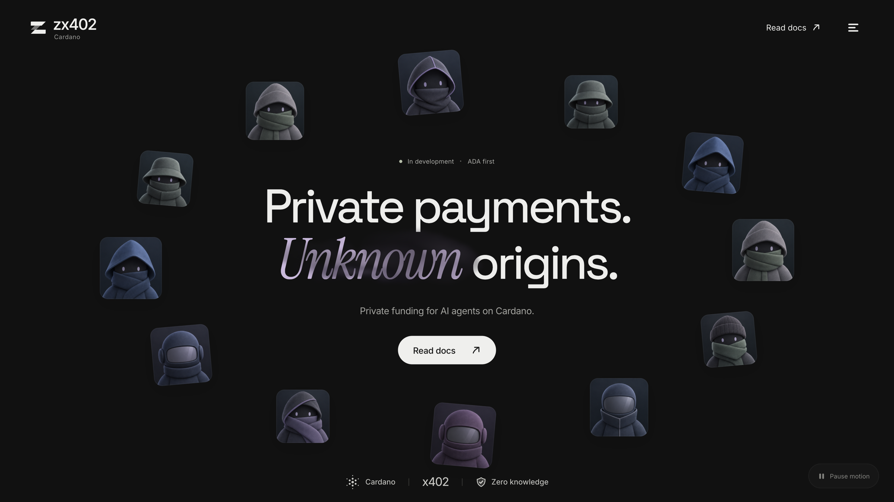
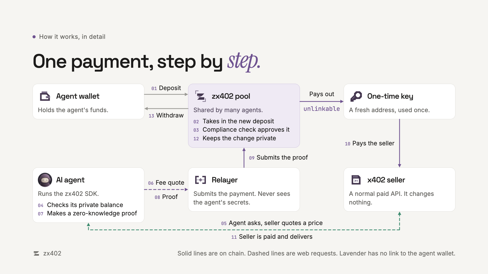
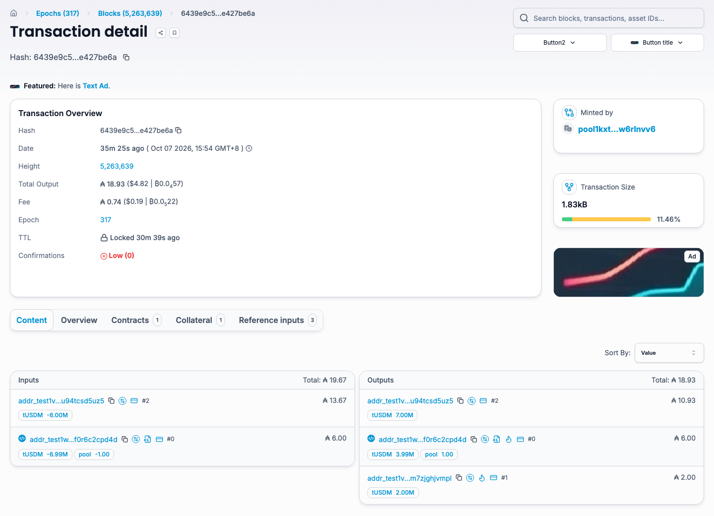
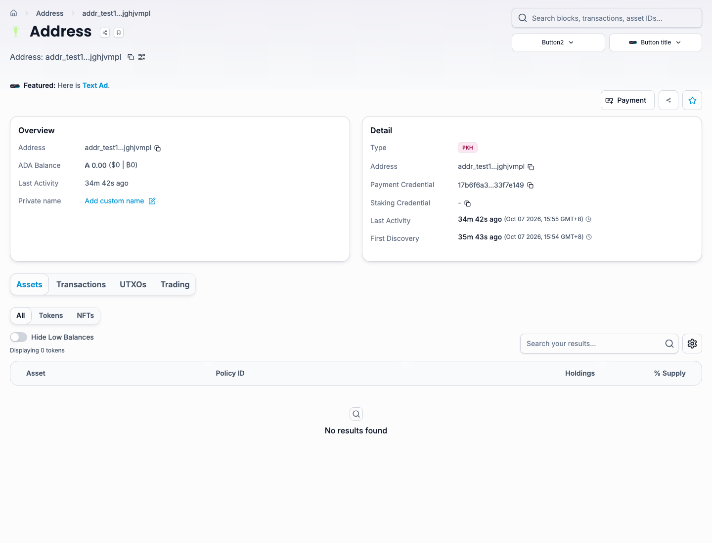
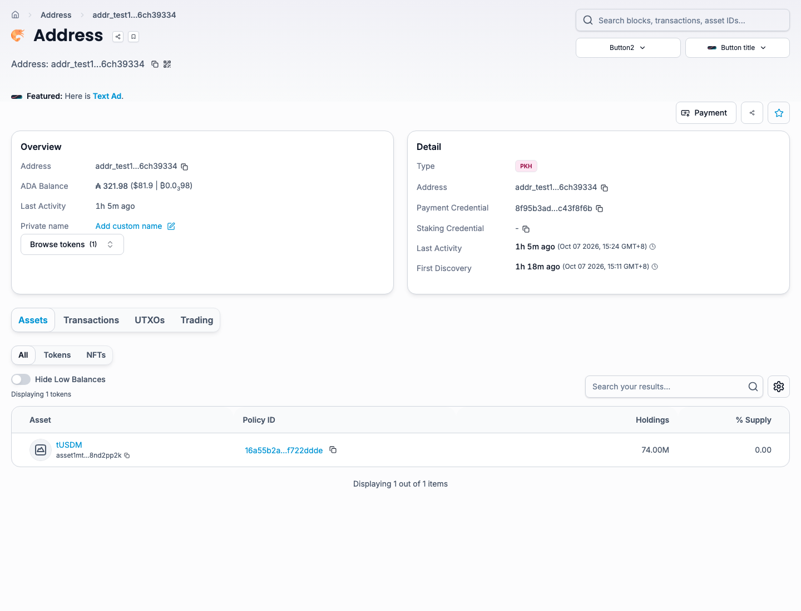
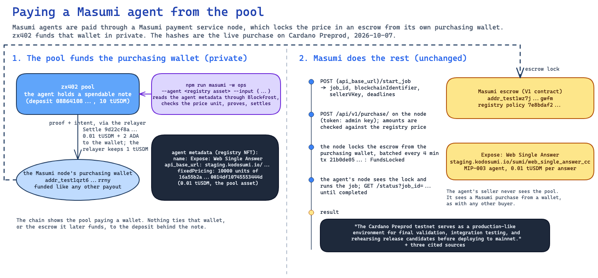
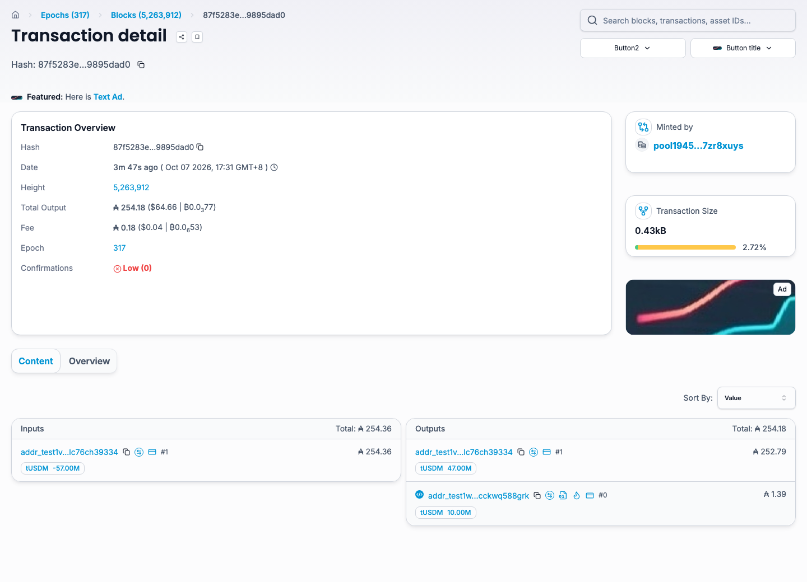
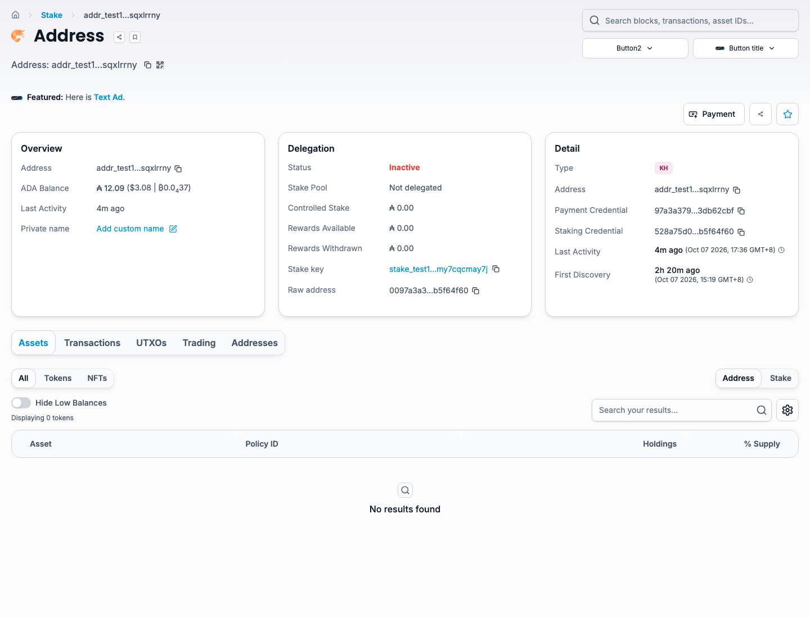
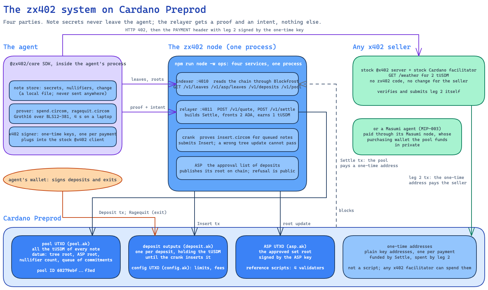

# zx402

<a href="https://zx402.org"></a>

<div align="center">

| Link | Where |
|---|---|
| Website | [zx402.org](https://zx402.org) |
| Documentation | [docs.zx402.org](https://docs.zx402.org) |
| Demo video | [zx402 video demo on YouTube](https://www.youtube.com/watch?v=GHoIhnhCIQY) |
| Pool contract (Preprod) | [addr_test1wpz3...cpd4d](https://preprod.cardanoscan.io/address/addr_test1wpz3ul73ektd57lzg7glcuz8xs3767dyqs2e8duyltf0r6c2cpd4d) |
| Deposit contract (Preprod) | [addr_test1wzg0...588grk](https://preprod.cardanoscan.io/address/addr_test1wzg094eeszpsn9uwspqg82gz0e3cr0vy23wlm75sggcckwq588grk) |
| Pool ID (Preprod) | [`60279ebf...f3ed`](https://preprod.cardanoscan.io/tokenPolicy/60279ebfb8db22bbe0cb2a1b7a61702ab36ade074a3866ac836df3ed) |
| Every script hash and address | [deployments/preprod.json](deployments/preprod.json) |

</div>

zx402 is private payments for AI agents on Cardano. An agent deposits tUSDM into a shared pool once, then pays x402 sellers from the pool with a zero-knowledge proof. The chain shows the pool as the payer, not the agent's wallet, and nothing links a payment to the deposit behind it. The seller runs stock x402 code and sees an ordinary payment. zx402 is live on the Preprod test network.

## The problem

An AI agent pays for data, tools and other agents many times a day, and on Cardano every one of those payments is public. x402 pays a seller straight from the agent's wallet, so one address carries the agent's whole history: which services it uses, how often, at what price, and how much money it has left. Anyone can read that trail. A competitor learns which data an agent buys, a seller can price by the balance it sees, and every service learns about every other one. An agent cannot keep the business process it runs private, because the payments that run it are open.

## The solution

zx402 puts a privacy pool between the agent and the seller. The agent deposits into the pool once, in public. From then on each payment is a zero-knowledge proof, made on the agent's own machine, that the agent owns an approved and unspent note in the pool. A relayer submits the proof, the pool pays a fresh one-time address, and that address pays the seller with a plain x402 payment. The seller gets paid, the agent gets its answer, and the chain shows only a pool paying one-time addresses, one per payment.

Three choices keep the design honest:

- **Nothing changes for the seller.** Any stock x402 seller on Cardano accepts the payment as it is, so sellers need no zx402 code. [Masumi](https://www.masumi.network/) agents work too: the pool funds the purchasing wallet of their payment node in private.
- **Privacy with a gate, not a hiding place.** Only deposits that the approval service has approved can pay in private, and a refusal is public. A deposit the service does not approve can only go back the way it came, in public.
- **Always an exit.** The depositor can take the rest back in public with a signature at any time. No service can block it.

## Where it stands

**Preprod (2026-10-07):** live. The pool `60279ebfb8db22bbe0cb2a1b7a61702ab36ade074a3866ac836df3ed` holds tUSDM, the Preprod stablecoin. With the code of this repository an agent funded the pool, paid a stock x402 seller 2 tUSDM in private through a one-time address and got the seller's answer back, and paid a Masumi agent 0.01 tUSDM for a web-search answer. The proof is below, with every transaction on the explorer.

**Mainnet** is the next step and is not deployed. Before it takes outside funds it needs a key ceremony with several parties, an on-chain check of the pool's start state and an outside audit. Nobody outside this project has reviewed the design or the code yet.

**Documentation:** [docs.zx402.org](https://docs.zx402.org/) explains how it works in plain words and carries every document from `docs/`. Run it locally with `npm run docs:dev`. New here? Read [docs/HANDOFF.md](docs/HANDOFF.md) first.

## How it works

<picture>
  <source media="(prefers-color-scheme: dark)" srcset="docs/diagrams/payment-steps-dark.png">
  
</picture>

1. **Deposit.** The agent sends tUSDM to the deposit script with a hidden commitment to a secret note.
2. **Approve.** The approval service checks the deposit and adds it to the approved set. Only approved deposits pay in private.
3. **Pay.** The agent proves in zero knowledge that it owns an approved, unspent note. The pool pays a fresh one-time address, and that address pays the seller with a plain x402 payment that any stock seller accepts.
4. **Change.** What is left becomes a new note in the pool. One deposit pays many times.
5. **Exit.** The depositor can always take the rest back in public with a signature. No service can block it.

The validators are written in Aiken. The circuits are Circom with Groth16 on BLS12-381. The off-chain code is TypeScript. The diagram above is the last slide of the pitch deck. A more detailed diagram, with every transaction of the Preprod run, is [docs/diagrams/private-payment.png](docs/diagrams/private-payment.png). Its source is `docs/diagrams/private-payment.excalidraw`.

## Two demos on Preprod, with the trail

Both demos ran live on Cardano Preprod on 2026-10-07 with the code of this repository. Each one shows the terminal output, the explorer links for every transaction and address, and screenshots of the explorer pages. The explorer cannot connect the agent's wallet to the payment in either demo.

| Demo | What is paid | Who receives | Terminal log |
|---|---|---|---|
| 1 | 2 tUSDM for a weather forecast over plain x402 | A stock x402 seller that knows nothing about the pool | [docs/evidence/staged-demo-2026-10-07.log](docs/evidence/staged-demo-2026-10-07.log) |
| 2 | 0.01 tUSDM for a web-search answer from a Masumi agent | The Masumi agent "Expose: Web Single Answer", through its Masumi escrow | [docs/evidence/masumi-demo-2026-10-07.log](docs/evidence/masumi-demo-2026-10-07.log) |

### Demo 1: a stock x402 seller, paid in private

The pool was funded earlier, then one command makes one private payment and the seller answers. Everything below comes from the run at 07:54 UTC.

```text
$ npm run demo -w ops -- --reuse --no-exit
Seller asks 2000000 16a55b2a...0014df10745553444d for the weather
Note c5 in the pool covers the price plus fees 1000000 ...; no deposit
Private payment 6439e9c5eec05c2692995ab17c7164be38e068003ec832e21c51a1b1e427be6a confirmed in 21.182 seconds
Seller payment c493eeedb959bc091da233b0971bd1818faed68efca60ad324e263e3b5e57640 returned HTTP 200 in 96.562 seconds
Change c6 stays in the pool for the next payment
Demo complete in 99.706 seconds
What the chain shows, on the explorer:
  Pool            https://preprod.cardanoscan.io/address/addr_test1wpz3ul73ektd57lzg7glcuz8xs3767dyqs2e8duyltf0r6c2cpd4d
  Agent's wallet  https://preprod.cardanoscan.io/address/addr_test1vz8etvadesg5a9stprjnajwqwr3g4u4d4pd0dgx9cslc76ch39334
                  funded the pool earlier; it does not appear below
  Private payment https://preprod.cardanoscan.io/transaction/6439e9c5eec05c2692995ab17c7164be38e068003ec832e21c51a1b1e427be6a
                  the pool pays one-time address addr_test1vqtmda4r0wahacczv389p38xz5337w8uknjc5auxx0m7zjghjvmpl with a proof; no deposit is named
  One-time addr   https://preprod.cardanoscan.io/address/addr_test1vqtmda4r0wahacczv389p38xz5337w8uknjc5auxx0m7zjghjvmpl
  Seller payment  https://preprod.cardanoscan.io/transaction/c493eeedb959bc091da233b0971bd1818faed68efca60ad324e263e3b5e57640
                  the one-time address pays the seller addr_test1vrc63vsk9tuarc0ry4stx6j2k2myl7zqn4lx6x27psl5s7sez46cl through stock x402
  Seller          https://preprod.cardanoscan.io/address/addr_test1vrc63vsk9tuarc0ry4stx6j2k2myl7zqn4lx6x27psl5s7sez46cl
Not on the chain: any link from the agent's wallet or its deposit to the one-time address or the seller.
{"weather":"sunny","temperatureC":28}
```

The last line is the resource itself: the seller's answer, returned to the payer with HTTP 200 after the payment settled.

#### What to check on the explorer

Each link opens on Cardanoscan and on cexplorer; the screenshots are from cexplorer.

| Step | What the page shows | Cardanoscan | cexplorer |
|---|---|---|---|
| The private payment (Settle) | Inputs: the pool script UTXO and the relayer's wallet. Outputs: the pool (3.99 tUSDM left, with the pool NFT), the relayer's change (its 1 tUSDM fee), and 2 tUSDM plus 2 ADA to a one-time address. The agent's wallet is nowhere in it. | [6439e9c5…](https://preprod.cardanoscan.io/transaction/6439e9c5eec05c2692995ab17c7164be38e068003ec832e21c51a1b1e427be6a) | [6439e9c5…](https://preprod.cexplorer.io/tx/6439e9c5eec05c2692995ab17c7164be38e068003ec832e21c51a1b1e427be6a) |
| The seller payment (leg 2) | One input, the one-time address. One output, the seller: 2 tUSDM plus 1.83 ADA. Submitted by the seller's stock x402 facilitator. | [c493eeed…](https://preprod.cardanoscan.io/transaction/c493eeedb959bc091da233b0971bd1818faed68efca60ad324e263e3b5e57640) | [c493eeed…](https://preprod.cexplorer.io/tx/c493eeedb959bc091da233b0971bd1818faed68efca60ad324e263e3b5e57640) |
| The one-time address | Created by the Settle at 07:54 UTC, emptied by the seller payment at 07:55 UTC, balance zero. Two transactions in its whole life. | [addr_test1vqtm…vmpl](https://preprod.cardanoscan.io/address/addr_test1vqtmda4r0wahacczv389p38xz5337w8uknjc5auxx0m7zjghjvmpl) | [addr_test1vqtm…vmpl](https://preprod.cexplorer.io/address/addr_test1vqtmda4r0wahacczv389p38xz5337w8uknjc5auxx0m7zjghjvmpl) |
| The agent's wallet | Its transactions are incoming funding, deposits into the pool and public exits from it. It never sent anything to the one-time address or to the seller. | [addr_test1vz8e…9334](https://preprod.cardanoscan.io/address/addr_test1vz8etvadesg5a9stprjnajwqwr3g4u4d4pd0dgx9cslc76ch39334) | [addr_test1vz8e…9334](https://preprod.cexplorer.io/address/addr_test1vz8etvadesg5a9stprjnajwqwr3g4u4d4pd0dgx9cslc76ch39334) |
| The seller's address | Receives 2 tUSDM from a fresh address each time. | [addr_test1vrc6…46cl](https://preprod.cardanoscan.io/address/addr_test1vrc63vsk9tuarc0ry4stx6j2k2myl7zqn4lx6x27psl5s7sez46cl) | [addr_test1vrc6…46cl](https://preprod.cexplorer.io/address/addr_test1vrc63vsk9tuarc0ry4stx6j2k2myl7zqn4lx6x27psl5s7sez46cl) |
| The pool | One script UTXO that holds every deposit's tUSDM and the pool NFT. | [addr_test1wpz3…pd4d](https://preprod.cardanoscan.io/address/addr_test1wpz3ul73ektd57lzg7glcuz8xs3767dyqs2e8duyltf0r6c2cpd4d) | [addr_test1wpz3…pd4d](https://preprod.cexplorer.io/address/addr_test1wpz3ul73ektd57lzg7glcuz8xs3767dyqs2e8duyltf0r6c2cpd4d) |

Why there is no link: the Settle carries a Groth16 proof whose public inputs are the pool's tree root, the approved-set root, a nullifier and the hash of the payment intent. The validator checks that proof. It never sees which note was spent, so the chain holds no path from any deposit to the one-time address. The proof and the note secrets are made on the agent's machine; the relayer only receives the proof and the intent.

**The private payment.** The pool and the relayer pay a one-time address. No wallet of the agent appears.



**The seller payment.** The one-time address pays the seller through the stock x402 flow.


**The one-time address.** First seen at 07:54 UTC, last active at 07:55 UTC, balance zero afterwards.



**The agent's wallet.** Only deposits and exits; no payment to any seller.



### Demo 2: a Masumi agent, paid in private

Masumi agents are paid through a Masumi payment service node, which locks the price in Masumi's escrow contract from its own purchasing wallet. The pool funds that wallet in private, and Masumi does the rest unchanged. This run started from a fresh deposit, so the whole trail is in one command: deposit, private payment, escrow lock, answer. It ran at 09:31 UTC against "Expose: Web Single Answer" (registry asset `7e8bdaf2…dbc77`), priced at 0.01 tUSDM.

<picture>
  <source media="(prefers-color-scheme: dark)" srcset="docs/diagrams/masumi-dark.png">
  
</picture>

```text
$ npm run masumi -w ops -- --deposit --agent 7e8bdaf2...dbc77 --input '{"question":"In one sentence, what is a zero-knowledge proof?"}'
Agent Expose: Web Single Answer: https://staging.kodosumi.io/sumi/web_single_answer_cc, price 10000 16a55b2a349361ff88c03788f93e1e966e5d689605d044fef722ddde.0014df10745553444d in 0.432 seconds
Agent is available and its input schema is loaded in 2.883 seconds
Deposit 87f5283ea9541ff6f563f20b817864bd5683c12f13fe561a2dc8ed9f9895dad0 submitted in 6.907 seconds
Deposit 87f5283ea9541ff6f563f20b817864bd5683c12f13fe561a2dc8ed9f9895dad0 is spendable in 144.101 seconds
Spendable note covers price 10000 plus fees 1000000 in 144.101 seconds
Settle 69c4014661a252ee35dd9cdf4f08d1a8b4799a6af7ac6767ef4f2a4b3ffb4144 submitted in 155.287 seconds
Settle 69c4014661a252ee35dd9cdf4f08d1a8b4799a6af7ac6767ef4f2a4b3ffb4144 confirmed and purchasing wallet funded in 233.863 seconds
Job 6ac6124d2173c611ccd0cb96 started with blockchainIdentifier 2986300c0cc06c08c04c01602704200e... in 256.139 seconds
Masumi purchase 2986300c0cc06c08c04c01602704200e... created on a Web3CardanoV1 source in 257.050 seconds
Escrow FundsLocked in transaction 0b2d5095d6f04804c7de5663deec89c8c39559a0a214a70968190ab172a0c2c2 in 515.825 seconds
Job 6ac6124d2173c611ccd0cb96 completed: "...the answer, printed in full below..." in 517.179 seconds
What the chain shows, on the explorer:
  Pool              https://preprod.cardanoscan.io/address/addr_test1wpz3ul73ektd57lzg7glcuz8xs3767dyqs2e8duyltf0r6c2cpd4d
  Agent's wallet    https://preprod.cardanoscan.io/address/addr_test1vz8etvadesg5a9stprjnajwqwr3g4u4d4pd0dgx9cslc76ch39334
  Deposit           https://preprod.cardanoscan.io/transaction/87f5283ea9541ff6f563f20b817864bd5683c12f13fe561a2dc8ed9f9895dad0
                    from the agent's wallet, in public like any deposit
  Private payment   https://preprod.cardanoscan.io/transaction/69c4014661a252ee35dd9cdf4f08d1a8b4799a6af7ac6767ef4f2a4b3ffb4144
                    the pool pays the Masumi node's purchasing wallet with a proof; no deposit is named
  Purchasing wallet https://preprod.cardanoscan.io/address/addr_test1qzt68gmewmcxczgmrz4h2lye29cv34vu0qard9pd8kmze06j3f6ap4jyrdplmta28nsjzty92ksxy5wm0ypend0kfasqxlrrny
  Escrow lock       https://preprod.cardanoscan.io/transaction/0b2d5095d6f04804c7de5663deec89c8c39559a0a214a70968190ab172a0c2c2
                    the purchasing wallet locks the price in the Masumi escrow, as any Masumi buyer does
  Escrow contract   https://preprod.cardanoscan.io/address/addr_test1wz7j4kmg2cs7yf92uat3ed4a3u97kr7axxr4avaz0lhwdsqukgwfm
  Agent             https://staging.kodosumi.io/sumi/web_single_answer_cc, job 6ac6124d2173c611ccd0cb96
Not on the chain: any link from the agent's wallet or its deposit to the purchasing wallet, the escrow or the Masumi agent.
```

#### What to check on the explorer

| Step | What the page shows | Cardanoscan | cexplorer |
|---|---|---|---|
| The deposit | The agent's wallet sends 10 tUSDM to the pool's deposit script, in public like any deposit. | [87f5283e…](https://preprod.cardanoscan.io/transaction/87f5283ea9541ff6f563f20b817864bd5683c12f13fe561a2dc8ed9f9895dad0) | [87f5283e…](https://preprod.cexplorer.io/tx/87f5283ea9541ff6f563f20b817864bd5683c12f13fe561a2dc8ed9f9895dad0) |
| The private payment (Settle) | Inputs: the pool script UTXO and the relayer. Outputs: the pool, the relayer's change, and 0.01 tUSDM plus 2 ADA to the Masumi node's purchasing wallet. No wallet of the agent, and no deposit named: the pool held several notes and the proof does not say which one paid. | [69c40146…](https://preprod.cardanoscan.io/transaction/69c4014661a252ee35dd9cdf4f08d1a8b4799a6af7ac6767ef4f2a4b3ffb4144) | [69c40146…](https://preprod.cexplorer.io/tx/69c4014661a252ee35dd9cdf4f08d1a8b4799a6af7ac6767ef4f2a4b3ffb4144) |
| The escrow lock | The purchasing wallet locks 0.01 tUSDM in the Masumi V1 escrow contract for job `6ac6124d2173c611ccd0cb96`, as any Masumi buyer does. Submitted by the Masumi node. | [0b2d5095…](https://preprod.cardanoscan.io/transaction/0b2d5095d6f04804c7de5663deec89c8c39559a0a214a70968190ab172a0c2c2) | [0b2d5095…](https://preprod.cexplorer.io/tx/0b2d5095d6f04804c7de5663deec89c8c39559a0a214a70968190ab172a0c2c2) |
| The purchasing wallet | A plain Masumi purchasing wallet. It receives tUSDM from the pool and locks it in the escrow. Nothing on its page points at the agent's wallet. | [addr_test1qzt6…rrny](https://preprod.cardanoscan.io/address/addr_test1qzt68gmewmcxczgmrz4h2lye29cv34vu0qard9pd8kmze06j3f6ap4jyrdplmta28nsjzty92ksxy5wm0ypend0kfasqxlrrny) | [addr_test1qzt6…rrny](https://preprod.cexplorer.io/address/addr_test1qzt68gmewmcxczgmrz4h2lye29cv34vu0qard9pd8kmze06j3f6ap4jyrdplmta28nsjzty92ksxy5wm0ypend0kfasqxlrrny) |
| The escrow contract | Masumi's V1 payment contract on Preprod, where every Masumi purchase is locked. | [addr_test1wz7j…gwfm](https://preprod.cardanoscan.io/address/addr_test1wz7j4kmg2cs7yf92uat3ed4a3u97kr7axxr4avaz0lhwdsqukgwfm) | [addr_test1wz7j…gwfm](https://preprod.cexplorer.io/address/addr_test1wz7j4kmg2cs7yf92uat3ed4a3u97kr7axxr4avaz0lhwdsqukgwfm) |
| The agent's wallet | Deposits into the pool and public exits. It never paid the purchasing wallet, the escrow or the agent. | [addr_test1vz8e…9334](https://preprod.cardanoscan.io/address/addr_test1vz8etvadesg5a9stprjnajwqwr3g4u4d4pd0dgx9cslc76ch39334) | [addr_test1vz8e…9334](https://preprod.cexplorer.io/address/addr_test1vz8etvadesg5a9stprjnajwqwr3g4u4d4pd0dgx9cslc76ch39334) |

The agent's answer came back through the Masumi job status, which the command polls until `completed`:

> A zero-knowledge proof is a cryptographic protocol that allows a prover to convince a verifier that a statement is true without revealing any information beyond the validity of that statement itself. Sources: [Zero-knowledge proofs | ethereum.org](https://ethereum.org/zero-knowledge-proofs/); [Zero-knowledge proof](https://en.wikipedia.org/wiki/Zero_knowledge_proof); [Proving Everything While Revealing Nothing: An Introduction to Zero-Knowledge Proofs | The Illogician](https://resources.illc.uva.nl/TheIllogician/posts/2026-i-mariana/).

**The deposit.** The agent's wallet funds the pool in public.



**The private payment.** The pool pays the Masumi node's purchasing wallet; no wallet of the agent appears.


**The escrow lock.** The purchasing wallet locks the price in the Masumi escrow, submitted by the Masumi node.


**The purchasing wallet.** Funded by the pool, spent into the escrow; nothing points back at the agent.



Earlier Masumi runs of the same day, including one split in two by a missing field in the agent's answer, are in [docs/measurements.md](docs/measurements.md) with sizes, fees and execution units read back from the chain.

## Run the demo

```sh
npm run node -w ops                                              # indexer on 4010, relayer on 4011, crank, ASP
SELLER_ADDRESS=<address> npm run seller -w examples/x402-seller  # a stock x402 seller on 4021, 2 tUSDM per forecast
npm run demo -w ops                                              # deposit 10 tUSDM, pay, exit the change
npm run demo -w ops -- --no-exit                                 # stage: deposit and pay, keep the change in the pool
npm run demo -w ops -- --reuse                                   # live: pay from a note already in the pool, no deposit
npm run masumi -w ops -- --agent <registry asset> --input '{"question":"..."}'   # pay a Masumi agent
```

The demo prints every transaction hash and the explorer links shown above. [docs/RUNBOOK.md](docs/RUNBOOK.md) has the full procedure, from keys to deploy.

## Try it from source

1. Install the tools: `npm ci`
2. Run the tests: `npm test`
3. Compile the circuits and make the development keys: `npm run build:circuits`, then `npm run setup:dev`
4. Run the tests again. The tests that need proofs no longer skip.

Step 3 takes about 30 minutes the first time. Without it, every test that needs a proving key skips with a clear message.

## The pieces

<picture>
  <source media="(prefers-color-scheme: dark)" srcset="docs/diagrams/system-dark.png">
  
</picture>

| Folder | What it holds |
|---|---|
| `apps/web` | The public landing page, [zx402.org](https://zx402.org) |
| `apps/docs` | The documentation site, built with Nextra and served at docs.zx402.org by Vercel |
| `circuits/` | The three circom circuits: spend, insert and ragequit |
| `contracts/` | The Aiken validators: pool, deposit, config, association set, and the token policy |
| `packages/crypto` | Hashes, notes, trees, encodings and key derivation |
| `packages/prover` | Proving and verifying with snarkjs |
| `packages/txlib` | Transaction builders, the Blockfrost provider, and a local test chain that runs the real validators |
| `packages/api` | The HTTP contracts of the indexer and the relayer, with clients |
| `packages/sdk` | The agent SDK, `@zx402/core`, with the stealth x402 signer |
| `services/` | The indexer, the crank, the association set provider service and the relayer |
| `ops/` | Key setup, deploy, the one-process node, the demo, the Masumi command and the admin command |
| `examples/x402-seller` | A stock x402 seller that knows nothing about the pool |
| `deployments/` | The record of the Preprod pool, its verification keys, and the retired pools |
| `docs/diagrams`, `docs/evidence` | The Excalidraw diagrams and the explorer screenshots of the live runs |
| `artifacts/` | Development verification keys and the order of public signals |

## Run the frontend

The landing page is in `apps/web`. Run these commands from the repo root:

```sh
npm ci
npm run dev
npm test -w apps/web
npm run build
```

Its "Read docs" buttons open the documentation site. The page has no wallet connection or transaction functions.

## Documents

| Document | What it covers |
|---|---|
| [docs/HANDOFF.md](docs/HANDOFF.md) | Start here: reading order, what is decided, what is verified, first tasks |
| [docs/PRD.md](docs/PRD.md) | Product requirements: users, scope, requirements, releases, risks |
| [docs/SPEC.md](docs/SPEC.md) | The design: cryptography, circuits, validators, transactions, x402 modes |
| [docs/PLAN-M0.md](docs/PLAN-M0.md) | Build plan of the first release: work packages and interfaces |
| [docs/TEST-PLAN.md](docs/TEST-PLAN.md) | Every test, with a stable ID, mapped to the Spec rules |
| [docs/TEST-VECTORS.md](docs/TEST-VECTORS.md) | Known answers for hashes, encodings, and proofs |
| [docs/SETUP.md](docs/SETUP.md) | Tools, versions, and known pitfalls |
| [docs/RUNBOOK.md](docs/RUNBOOK.md) | Exact commands for Preprod and the step-by-step mainnet canary |
| [docs/CEREMONY.md](docs/CEREMONY.md) | The Groth16 setup ceremony |
| [docs/measurements.md](docs/measurements.md) | Measured costs, and every transaction of the Preprod runs |
| [docs/research/](docs/research/) | Evidence: the raw data behind the first measurements, and three verified spikes |
| [AGENTS.md](AGENTS.md) | Hard rules for people and AI agents |
| [CONTRIBUTING.md](CONTRIBUTING.md) | Workflow and pull request checklist |

## The design in five lines

1. Notes live as commitments in a Poseidon Merkle tree. Funds sit in one pool UTXO.
2. A Groth16 proof over BLS12-381 authorizes every private payment.
3. The validator never hashes Poseidon. A second proof covers every tree update.
4. Spent notes are tracked in a Merkle Patricia Forestry root.
5. Payments reach stock x402 sellers through a one-time key (stealth mode).

## What fits and what does not

- It fits payments of a few tUSDM or more, and private funding of escrows, payment channels, and tabs.
- It does not fit cent-sized payments settled one by one. Cardano makes every output carry about 1 ADA, which the relayer attaches to each payout.
- What the chain still shows: that the pool paid, the amount, the time, and the exit back to a wallet. What it hides: which deposit, so which wallet, paid.

## Origin

The Base implementation is a Privacy Pools fork with an x402 facilitator.
This design adapts that architecture to Cardano's ledger limits.
It replaces the earlier private notes.

## License

MIT. See [LICENSE](LICENSE).

Dependencies keep their own licenses.
The prover uses snarkjs, which is GPL-3.0.
Check that before you ship a product that bundles it.
