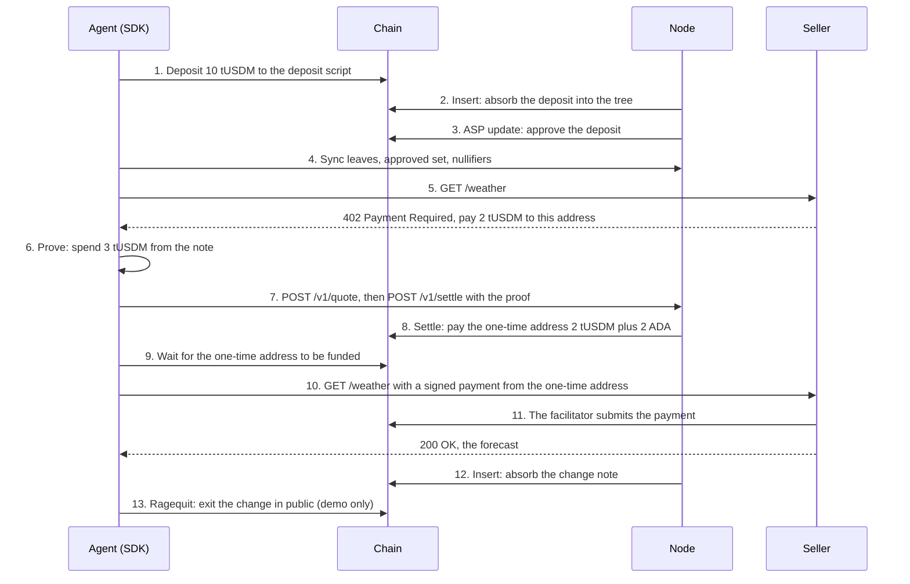

# The life of a payment

This page follows tUSDM from an agent's wallet to a seller. The transaction hashes come from the first live run on the tUSDM pool on Preprod, on 2026-10-07. You can open each one on a Preprod explorer. tUSDM is the Preprod stablecoin, with 6 decimals, so 10 tUSDM is 10,000,000 units.

## The parties

| Party | Role in this story |
|---|---|
| Agent | A program with a seed and a wallet. It wants a weather forecast from a seller that charges per request |
| Seller | A stock x402 server. It knows nothing about pools or proofs. It wants a normal Cardano payment |
| Node | One process run by an operator. It holds four services: the indexer, the crank, the ASP service and the relayer |
| Chain | Preprod, read through Blockfrost |

## The whole flow

<figure style={{ margin: '1.5rem 0 2rem' }}>
  
  <figcaption style={{ marginTop: 12, fontSize: '0.85rem', lineHeight: 1.5 }}>The three stages of a private payment, with the transactions of the zx402 pool run. Source: docs/diagrams/private-payment.excalidraw.</figcaption>
</figure>

## Step by step

### 1. Deposit

The agent asks the SDK for a deposit of 10 tUSDM. The SDK syncs first, so it never reuses a note secret. It derives a fresh nullifier and secret from its seed, computes the precommitment, and builds a transaction that sends 10 tUSDM to the deposit script. Every token output on Cardano needs some ADA, so the output also carries 1.39 ADA, the measured minimum for its size. The datum holds the precommitment and the hash of the agent's refund key.

Live run: deposit `7618ba9a3b33ae70ae9c23bcf7f4f5635def0c77a1ffd81d5ac8583b9fd01e8d`, fee 0.18 ADA, submitted 3.2 seconds after the start.

### 2. Insert

The crank watches the deposit address. It sees the new deposit, computes the label and the commitment, inserts the commitment into its copy of the state tree, and makes an insert proof. The transaction spends the pool UTXO and the deposit UTXO, credits the pool with the whole 10 tUSDM, and writes the new root into the pool datum. The crank keeps the 1.39 ADA that came with the deposit. That is its fee in a token pool.

Live run: Insert `3fe4adbde235b2d2657612666ac60229bcb3d3ae658cd8099d26e755285ff462`, fee 0.68 ADA, 3.09 billion CPU steps.

### 3. Approval

The ASP service sees the new label, checks it against its policy, adds it to the approved set and updates the ASP output with the new root. In the demo the policy approves every deposit. On a real pool the operator sets the policy.

Live run: ASP update `54290a18e7917be5d6aca5b71131f89852346841ff58dfd52b34bde3b18e6c84`, fee 0.22 ADA.

The note became spendable 139 seconds after the start. Most of that time was waiting for three blocks in a row.

### 4. Sync

The SDK downloads the leaves, the approved set and the spent nullifiers from the indexer. It checks the roots against the pool datum that it reads with its own chain provider, so a lying indexer cannot feed it a false tree. It now knows its note is in the tree and approved.

### 5. The 402

The agent calls the seller through `fetch`, wrapped by the x402 client. The seller answers HTTP 402 with payment requirements: 2 tUSDM to the seller's address on `cardano:preprod`, within a timeout. The asset is named by its policy and name, and the client refuses any asset that is not the pool's.

### 6. The proof

The SDK picks a one-time key from its seed, index `n`, and reserves it in its store before it moves any money. It asks its own provider for the fee rate from the config output and for the chain tip. It then proves a spend of 3 tUSDM: 2 tUSDM for the price and 1 tUSDM for the relayer. The ADA that the second transaction needs does not come from the note. The relayer attaches it. The proof binds the payout address, the amount, the relayer key and an expiry. Proving takes a few seconds on a laptop.

### 7. The relayer

The SDK asks the relayer for a quote and checks it: the protocol fee matches the chain, the relayer fee is within the agent's limit, the deadline is within 15 minutes of the tip, and the ADA the relayer attaches to the payout covers the seller's minimum plus the fee of the second transaction. It then posts the proof and the intent. The relayer checks the proof against the verification key, builds the Settle transaction, evaluates it, signs it and submits it. It answers with an ID that the SDK can poll.

The relayer never sees the nullifier, the secret, the label or the leaf. It sees a proof, the payouts and the agent's IP address.

### 8. Settle

The validator checks the proof, inserts the nullifier hash into the trie, pays the one-time address 2 tUSDM, leaves 1 tUSDM to the relayer, and queues the change commitment for the next Insert. The pool's token balance drops by the withdrawn 3 tUSDM and nothing else, and its 6 ADA stay. The relayer puts 2 ADA of its own on the one-time address output, so that address can pay the seller.

Live run: Settle `ca9178e1f0768c05cef31f5f0565411190ce4b9d18ba25fb2e8d4140db9db5d7`, fee 0.70 ADA, 3.26 billion CPU steps, confirmed 31 seconds after the payment request.

### 9. Funding confirmed

The SDK polls its provider until the one-time address holds exactly 2 tUSDM and at least the ADA it needs, from the Settle transaction. Then it builds the second leg.

### 10. The second leg

The SDK signs a plain payment of 2 tUSDM from the one-time address to the seller, with the one-time key, and sends the request again with the payment in the `X-PAYMENT` header. The seller output also carries the 2 ADA minus the fee, because a token output needs ADA and the one-time address keeps nothing. This is a stock x402 payment. The seller's facilitator verifies it and submits it to the chain.

Live run: seller payment `0f848755cd9e3309c15ea1a5622d4db53fed1ecea3f60fef9fe890873cc419ec`, fee 0.17 ADA. The seller answered HTTP 200 with the forecast 76 seconds after the request.

### 11. The change

The change of 7 tUSDM waits in the pool queue as a new commitment. The crank absorbs it with the next Insert, and the SDK's store marks the change note spendable. The next payment spends from the change.

Live run: Insert `38f59cd274f4d1813744c8b2020d32ae175aa2f356c4d92789d71d3ece1942e3`, fee 0.64 ADA. The change was spendable 24 seconds after the seller answered.

### 12. The exit

The demo ends with a public exit, to show that nothing is stuck. The SDK proves that the change note is in the tree, signs with the refund key, and the pool pays the 7 tUSDM to the agent's wallet, with 1.06 ADA from the wallet itself as the output's minimum. On a real agent this step never happens unless the agent wants its money out.

Live run: Ragequit `fb038a0197d25aeea3890ab5ccc7a9a990736256e4f44366e1b7484fe28760a2`, fee 0.65 ADA, confirmed 133 seconds after the change was spendable. Preprod made no block for 154 seconds before it.

## What the chain shows

| Transaction | What a watcher sees |
|---|---|
| Deposit | The agent's wallet sent 10 tUSDM and 1.39 ADA to the deposit script, with a hash and a key hash in the datum |
| Insert | The pool absorbed a deposit. The root changed |
| ASP update | The approved set grew |
| Settle | The pool paid 2 tUSDM to a new address and 1 tUSDM to the relayer. The relayer put 2 ADA on the new address. A nullifier hash was published |
| Seller payment | The new address paid 2 tUSDM and 1.83 ADA to the seller |
| Insert | The pool absorbed one queued commitment |
| Ragequit | The pool paid 7 tUSDM to the agent's wallet |

The link between the deposit and the Settle is missing. With one deposit in the pool a watcher can guess it. With a thousand, the watcher cannot. The [privacy page](/guide/privacy) goes through what each party learns, and why the demo's public exit gives the game away.
