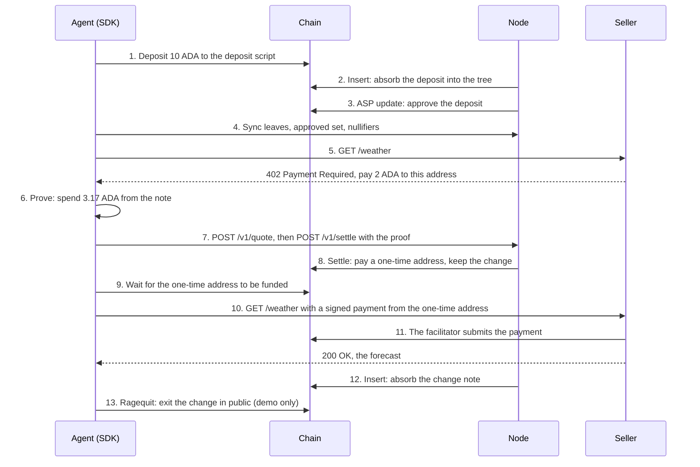

# The life of a payment

This page follows one ADA from an agent's wallet to a seller. The transaction hashes come from the sixth live run on Preprod, on 2026-10-06. You can open each one on a Preprod explorer.

## The parties

| Party | Role in this story |
|---|---|
| Agent | A program with a seed and a wallet. It wants a weather forecast from a seller that charges per request |
| Seller | A stock x402 server. It knows nothing about pools or proofs. It wants a normal Cardano payment |
| Node | One process run by an operator. It holds four services: the indexer, the crank, the ASP service and the relayer |
| Chain | Preprod, read through Blockfrost |

## The whole flow

## Step by step

### 1. Deposit

The agent asks the SDK for a deposit of 10 ADA. The SDK syncs first, so it never reuses a note secret. It derives a fresh nullifier and secret from its seed, computes the precommitment, and builds a transaction that sends 10 ADA to the deposit script. The datum holds the precommitment and the hash of the agent's refund key.

Run 6: deposit `b0401cb76ee30e1f7f736a4880594b40bc8335eb95523c6341e6433913a49996`, fee 0.17 ADA, submitted 2.9 seconds after the start.

### 2. Insert

The crank watches the deposit address. It sees the new deposit, computes the label and the commitment, inserts the commitment into its copy of the state tree, and makes an insert proof. The transaction spends the pool UTXO and the deposit UTXO, credits the pool with 9.7 ADA, which is the deposit minus the crank fee of 0.3 ADA, and writes the new root into the pool datum.

Run 6: Insert `bedb012c45c0cb8dd4b855126cd747bb9066b3da9f85075c82547a3daa299974`, fee 0.71 ADA, 3.28 billion CPU steps.

### 3. Approval

The ASP service sees the new label, checks it against its policy, adds it to the approved set and updates the ASP output with the new root. In the demo the policy approves every deposit. On a real pool the operator sets the policy.

Run 6: ASP update `75ce39638f893d2a6b2beb09a720dd15300df6d0d509f867ab4d9bb5e01518c9`, fee 0.22 ADA.

The note became spendable 140 seconds after the start. Most of that time was waiting for three blocks in a row.

### 4. Sync

The SDK downloads the leaves, the approved set and the spent nullifiers from the indexer. It checks the roots against the pool datum that it reads with its own chain provider, so a lying indexer cannot feed it a false tree. It now knows its note is in the tree and approved.

### 5. The 402

The agent calls the seller through `fetch`, wrapped by the x402 client. The seller answers HTTP 402 with payment requirements: 2 ADA to the seller's address on `cardano:preprod`, within a timeout.

### 6. The proof

The SDK picks a one-time key from its seed, index `n`, and reserves it in its store before it moves any money. It asks its own provider for the fee rate from the config output and for the chain tip. It then proves a spend of 3.17 ADA: 2 ADA for the price, 1 ADA for the relayer and 0.17 ADA for the fee of the second transaction. The proof binds the payout address, the amount, the relayer key and an expiry. Proving takes a few seconds on a laptop.

### 7. The relayer

The SDK asks the relayer for a quote and checks it: the protocol fee matches the chain, the relayer fee is within the agent's limit, and the deadline is within 15 minutes of the tip. It then posts the proof and the intent. The relayer checks the proof against the verification key, builds the Settle transaction, evaluates it, signs it and submits it. It answers with an ID that the SDK can poll.

The relayer never sees the nullifier, the secret, the label or the leaf. It sees a proof, the payouts and the agent's IP address.

### 8. Settle

The validator checks the proof, inserts the nullifier hash into the trie, pays the one-time address 3.17 ADA, pays the relayer 1 ADA, and queues the change commitment for the next Insert. The pool balance drops by the withdrawn amount and nothing else.

Run 6: Settle `8aa14376b07df1d1c5f1862c3981656e71451c0ecc0335606d7427302f463802`, fee 0.73 ADA, 3.29 billion CPU steps, confirmed 35 seconds after the payment request.

### 9. Funding confirmed

The SDK polls its provider until the one-time address holds exactly 3.17 ADA from the Settle transaction. Then it builds the second leg.

### 10. The second leg

The SDK signs a plain payment of 2 ADA from the one-time address to the seller, with the one-time key, and sends the request again with the payment in the `X-PAYMENT` header. This is a stock x402 payment. The seller's facilitator verifies it and submits it to the chain.

Run 6: seller payment `31ecb799a2ecf591030562aa79940d2cb74071bedaf1819c54fe6d617b0ea5ff`, fee 0.17 ADA. The seller answered HTTP 200 with the forecast 178 seconds after the request, because Preprod made no block for 132 seconds in the middle. A normal run takes about 80 seconds.

### 11. The change

The change of about 6.53 ADA waits in the pool queue as a new commitment. The crank absorbs it with the next Insert, and the SDK's store marks the change note spendable. The next payment spends from the change.

Run 6: Insert `fcb2adb5066e8d76c434f22ef4abfed2cfe5ef788b70ccf628430b73698a5193`, fee 0.66 ADA. The change was spendable 0.1 seconds after the seller answered, because the crank had already absorbed it.

### 12. The exit

The demo ends with a public exit, to show that nothing is stuck. The SDK proves that the change note is in the tree, signs with the refund key, and the pool pays the 6.53 ADA to the agent's wallet. On a real agent this step never happens unless the agent wants its money out.

Run 6: Ragequit `e71971072dd46b50c2b600790d1bce87ee1b44b1eef3cf2b09a7288671e4b0b9`, fee 0.68 ADA, confirmed 20 seconds after the change was spendable.

## What the chain shows

| Transaction | What a watcher sees |
|---|---|
| Deposit | The agent's wallet sent 10 ADA to the deposit script, with a hash and a key hash in the datum |
| Insert | The pool absorbed a deposit. The root changed |
| ASP update | The approved set grew |
| Settle | The pool paid 3.17 ADA to a new address and 1 ADA to the relayer. A nullifier hash was published |
| Seller payment | The new address paid 2 ADA to the seller |
| Insert | The pool absorbed one queued commitment |
| Ragequit | The pool paid 6.53 ADA to the agent's wallet |

The link between the deposit and the Settle is missing. With one deposit in the pool a watcher can guess it. With a thousand, the watcher cannot. The [privacy page](/guide/privacy) goes through what each party learns, and why the demo's public exit gives the game away.
