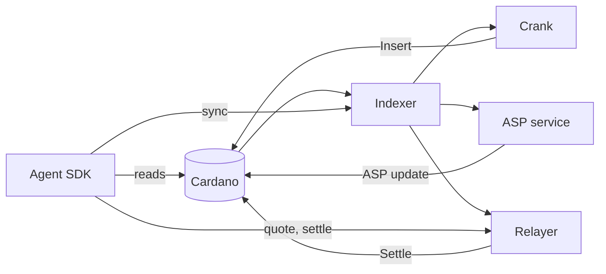

# The services

Four off-chain services keep the pool moving. One operator runs all four in one process, the node. None of them holds a note secret, and none of them is trusted by the agent: the chain checks every transaction they send, and the SDK checks every answer they give against the chain.

## The indexer

The indexer follows the pool from its first transaction and rebuilds the state off chain: every leaf of the state tree, every label, every spent nullifier hash and every deposit output. After each pool transaction it checks its rebuilt tree root and nullifier root against the new pool datum. If they differ it stops with an error rather than serve wrong data.

It serves over HTTP, on port 4010 by default.

| Route | Returns |
|---|---|
| `GET /v1/pool` | The pool state: roots, size, queue, nullifier root, fees, the ASP root, the config and the chain tip |
| `GET /v1/leaves?from=&limit=` | A page of state tree leaves, with the root and size they belong to |
| `GET /v1/asp/leaves?from=&limit=` | A page of approved labels |
| `GET /v1/deposits?from=&limit=` | Deposit outputs, absorbed or waiting, with their precommitment and refund key |
| `GET /v1/nullifiers?from=&limit=` | Spent nullifier hashes |

The SDK and the crank never trust a page on its own. They rebuild the tree from the leaves and compare the root with the pool datum that they read from the chain themselves. A lying or stale indexer produces a mismatch, and the client refuses to go on.

## The crank

The crank turns waiting deposits and queued change notes into tree leaves. On each tick it reads the pool, the config and the deposit outputs from the chain, downloads the leaves from the indexer, rebuilds the tree and checks the root. Then it plans an Insert: up to 4 slots, queued notes first, then deposits that pass the config limits. It makes the insert proof, builds the transaction, evaluates it, signs it with the crank key and submits it.

The crank remembers the pool output it spent. While that spend waits for a block it does nothing, and after 3 minutes without a confirmation it tries again. It takes the crank fee of 0.3 ADA from each deposit it absorbs. Note inserts earn nothing, and the relayer fee is meant to cover them.

## The ASP service

The ASP service approves deposits. It watches the labels that the indexer reports, applies its policy, and keeps the approved labels in a file. When new labels pass, it builds a Merkle tree of the approved set and updates the ASP output with the new root, signed by the operator keys. The demo policy approves every deposit. An operator can pass a `deny` rule.

The approved tree uses the same Poseidon hash and depth as the state tree, so one spend proof can prove membership in both.

## The relayer

The relayer submits Settle transactions for agents. It serves over HTTP on port 4011 by default.

| Route | What it does |
|---|---|
| `POST /v1/quote` | Takes the payouts. Returns the protocol fee, the relayer fee, the relayer key and a `valid_until` deadline |
| `POST /v1/settle` | Takes the proof, the public inputs and the intent. Checks the proof, builds and submits the Settle transaction. Returns an ID |
| `GET /v1/settle/:id` | Returns `submitted` or `confirmed` with the transaction hash |
| `GET /v1/pool` | The same pool view as the indexer |

Before it submits, the relayer checks the proof against the spend verification key, checks that the state root is one of the 16 in the datum, that the ASP root is current, that the nullifier is unspent, that the queue has room, and that the quote has not expired. Each failure has its own error code.

| Code | Meaning |
|---|---|
| `bad_request` | The body is malformed |
| `invalid_proof` | The proof does not verify |
| `intent_mismatch` | The intent does not match the quote or the context |
| `stale_root` | The state root is no longer in the history |
| `stale_asp_root` | The ASP root changed. Prove again with the new one |
| `nullifier_spent` | The note was already spent |
| `queue_full` | The pool queue holds 8 entries. Wait for the crank |
| `quote_expired` | The deadline passed |
| `not_found` | Unknown settle ID |
| `internal` | Any other failure before a transaction was sent |
| `uncertain` | The relayer sent a transaction and cannot say whether it will land |

The `uncertain` code matters for money. Once the relayer has called submit, it never reports a definite failure, because the transaction may still land. The SDK keeps its note reserved after an `uncertain` answer, polls the settle ID, and lets the chain decide. Only the ten definite refusals release a note for a new attempt.

The relayer earns 1 ADA per settle in the demo. The agent fixes that fee inside the proof, so a relayer cannot raise it after the fact.

## The node

`npm run node -w ops` starts all four services with one Blockfrost project ID and one operator seed from `.env`. The crank, relayer and ASP keys derive from that seed with different role paths, so one funded operator wallet feeds three roles. The node writes the ASP store to disk and logs each transaction.

The node is an operator's tool. It can run anywhere. Several operators could run independent nodes against one pool, because nothing in the pool trusts them. Only the ASP keys are special, and only for approvals.

## What the SDK checks

The services are convenient, not trusted. The SDK trusts its own seed and its own chain provider, and nothing else.

- It reads the pool datum, the config and the chain tip with its own provider.
- It rebuilds the state tree and the ASP tree from the indexer's leaves and compares the roots.
- It reads the fee rate from the config output on chain, not from the quote.
- It refuses a quote whose deadline is past or more than 15 minutes after the tip.
- It refuses a relayer fee above its own limit, 2 ADA by default.
- It follows the exact output of a deposit it sent itself, so a copied precommitment cannot take its place.

The [SDK page](/guide/sdk-and-x402) shows how an agent uses all this.
