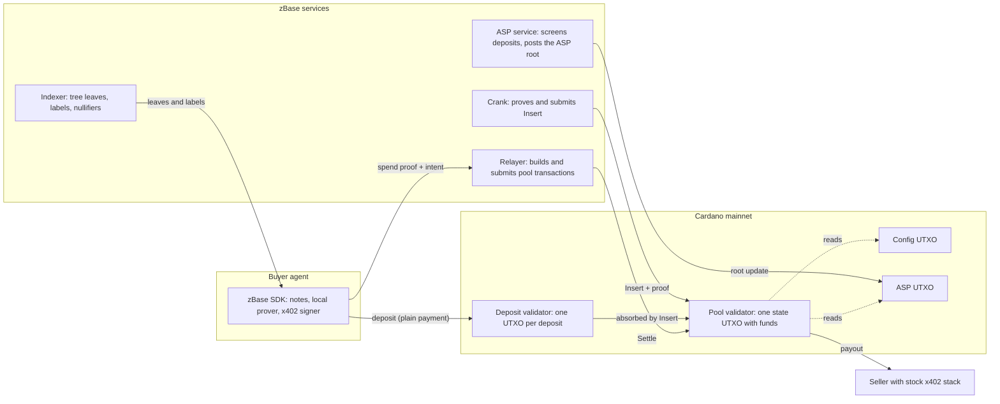
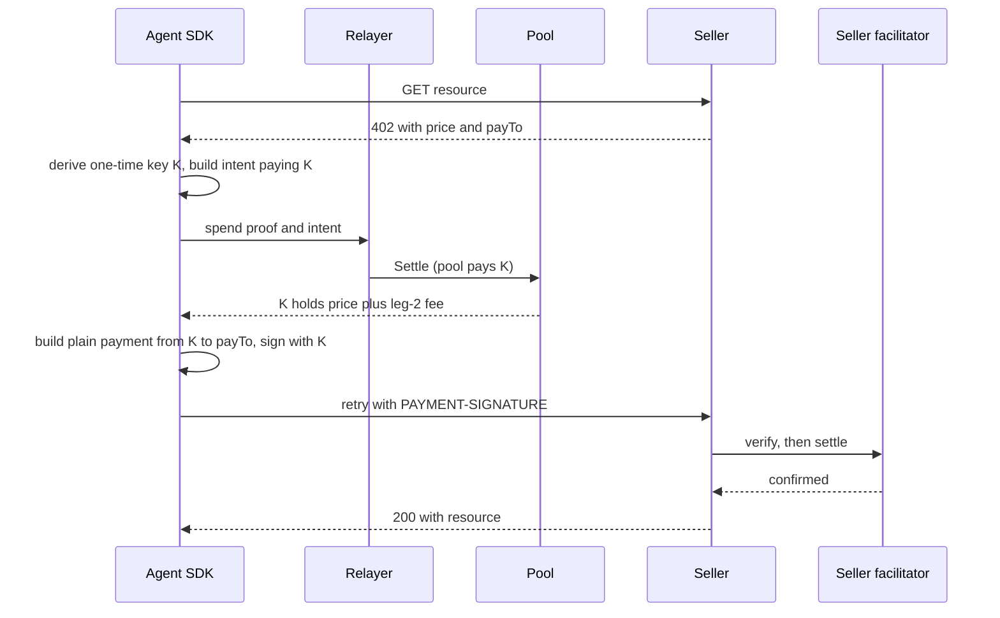

# zBase Cardano: Technical Specification

| Field | Value |
|---|---|
| Status | Approved v1.0. The owner approved the design on 2026-10-06 |
| Date | 2026-10-06 |
| Owner | Marcus |
| Companions | [PRD.md](./PRD.md), [PLAN-M0.md](./PLAN-M0.md), [TEST-PLAN.md](./TEST-PLAN.md), [TEST-VECTORS.md](./TEST-VECTORS.md) |
| Target network | Cardano mainnet, protocol version 11 |

This document says how zBase Cardano works and why.
Requirement IDs such as FR-P3 point to the PRD.
Numbers marked "measured" come from runs or live chain data listed in Appendix A.
Numbers marked "estimate" must be replaced by measurements during M0.

This document is the single source of truth for the design. If code and this document disagree, fix one of them in the same change.

## 1. Scope

In scope for v1:

- One shielded pool per asset. The first pool holds ADA.
- Deposit, tree insert, private settle, public exit (ragequit), fee collection.
- A compliance gate through an ASP root (approved-deposit list).
- x402 integration in three modes, with stealth mode first.
- Off-chain services: SDK, relayer, crank, indexer.
- Mainnet rollout with on-chain caps.

Out of scope for v1: hidden amounts, hidden recipients on-chain, multi-input notes, nullifier sharding, cross-chain.

## 2. Design decisions

Each decision lists the main alternative and why it lost.

| ID | Decision | Rejected alternative | Reason |
|---|---|---|---|
| D1 | Groth16 over BLS12-381, circuits in circom, proofs with snarkjs | PLONK, Halo2 | Groth16 has the cheapest verifier on Cardano: 2.0B to 2.7B CPU (measured). PLONK measures about 5B. |
| D2 | Keep the Privacy Pools note model of zBase on Base | A new 2-in 2-out note model | Smallest change from the audited design. Fewer public inputs. |
| D3 | The validator never computes Poseidon. A proof covers each tree update | Hash the tree on-chain | One Poseidon hash costs 1.27B CPU and 3.7M memory (measured). A depth 32 insert cannot fit. |
| D4 | Tree updates are permissionless and proven (Insert) | A root posted by a trusted operator | A trusted root lets its poster forge notes and drain the pool. |
| D5 | Deposits are plain payments to a deposit address. Insert binds their value in-circuit | A proof at deposit time | Any wallet can deposit. No contention between depositors. Costs are shared across a batch. |
| D6 | Spent tags live in one Merkle Patricia Forestry root | One UTXO or token per nullifier | No ADA locked per payment. No minting, which stock x402 facilitators reject. |
| D7 | One pool UTXO holds funds and state | Per-deposit UTXOs | Spending your own deposit UTXO reveals the link. Funds must be fungible. |
| D8 | Root history of 16 roots | Current root only | User proofs stay valid while inserts land. |
| D9 | Poseidon255 parameters from `poseidon-bls12381-circom` | Foundation or ZeroJ set, circomlib constants | Used by live Cardano projects. Its width-3 instance, which hashes tree nodes, is in the draft Poseidon builtin CIP registry. |
| D10 | Spend validators only. No mint, no reward withdrawal in any pool transaction | The withdraw-zero trick, nullifier tokens | Stock x402 facilitators reject such transactions. |
| D11 | Stealth mode is the default x402 path | Hand the pool transaction to the seller | Facilitators differ on script-funded inputs. A plain payment from a one-time key works everywhere. |
| D12 | The agent proves locally by default | Server-side proving as on Base | The relayer never sees note secrets. The spend circuit is small enough. |
| D13 | Verification keys are script parameters. Scripts are immutable | Keys in an updatable datum | Nobody can swap a key. A fix is a new pool version. |
| D14 | The admin can pause deposits and tune bounded fees and caps. Nothing else | A full pause or upgrade key | No admin path can move or freeze funds (FR-A3). |

## 3. System overview



Components:

| Component | Runs where | Role |
|---|---|---|
| Pool validator | Chain | Holds funds and state. Checks proofs. Enforces every money rule. |
| Deposit validator | Chain | Holds deposits until Insert absorbs them. Allows refunds. |
| Config UTXO | Chain | Caps, fees, pause flag, treasury, admin keys. Read as a reference input. |
| ASP UTXO | Chain | The current ASP root. Read as a reference input. |
| SDK | Agent machine | Creates notes, syncs the tree, proves, builds x402 payments. |
| Relayer | Our server | Sequences pool transactions, provides collateral, quotes fees. |
| Crank | Our server, or anyone | Proves and submits Insert. |
| Indexer | Our server, or anyone | Serves leaves, labels, nullifiers, and pool state. |
| ASP service | Our server | Screens deposits and updates the ASP root. |

## 4. Cryptographic primitives

### 4.1 Curve and proof system

- Curve: BLS12-381. Plutus V3 has builtins for it.
- Scalar field prime `r` = `0x73eda753299d7d483339d80809a1d80553bda402fffe5bfeffffffff00000001`.
- Proof system: Groth16. A proof is 192 bytes: A (G1, 48 bytes), B (G2, 96 bytes), C (G1, 48 bytes).
- Circuits compile with `circom --prime bls12381`. Proving uses snarkjs with curve `bls12-381`.
- Points cross the chain boundary in the compressed Zcash format that the builtins expect.

### 4.2 Hash functions

| Name | Definition | Used for | Where computed |
|---|---|---|---|
| H1(a) | `Poseidon255(1)`, width 2, 8 full and 56 partial rounds | Nullifier hash | Circuit and SDK only |
| H2(a, b) | `Poseidon255(2)`, width 3, 8 full and 56 partial rounds | Tree nodes, precommitment | Circuit and SDK only |
| H3(a, b, c) | `Poseidon255(3)`, width 4, 8 full and 56 partial rounds | Commitment | Circuit and SDK only |
| blake2b_256 | Plutus builtin | Label, context, nullifier set | Chain and SDK |

Poseidon255 comes from `poseidon-bls12381-circom` 1.0.0 (MIT).
The SDK uses the matching TypeScript library and must pass shared known-answer tests.
Never use `circomlibjs` Poseidon. It hashes over BN254 and gives different values.

### 4.3 Note model

A note is the tuple `(value, label, nullifier, secret)`.

```text
precommitment = H2(nullifier, secret)
commitment    = H3(value, label, precommitment)
nullifierHash = H1(nullifier)
```

- `value` is an integer below 2^64, in lovelace or token base units.
- `label` identifies the original deposit. A change note keeps the label of the note it came from.
- `nullifier` and `secret` are random field elements that only the owner knows.

This matches the note model of zBase on Base.

### 4.4 Label

The chain derives the label when Insert absorbs a deposit.

```text
label_preimage = "zbase/label/v1"                 14 ASCII bytes
              || pool_id                          28 bytes
              || deposit_tx_id                    32 bytes
              || u32_be(deposit_output_index)      4 bytes
              || refund_key_hash                  28 bytes

label = int_be( first 31 bytes of blake2b_256(label_preimage) )
```

- `pool_id` is the policy ID of the pool NFT.
- The first 31 bytes give a 248-bit integer, which is always below `r`.
- The validator rejects a label of 0.

Binding the refund key into the label lets ragequit authenticate the depositor without a table on-chain.

### 4.5 Intent and context

A settle is bound to one intent:

```aiken
type Payout {
  address: Address,
  amount: Int,
  datum_hash: Option<ByteArray>,
}

type SettleIntent {
  pool_id: ByteArray,
  payouts: List<Payout>,
  relayer: Option<VerificationKeyHash>,
  valid_until: Int,
}
```

The validator and the SDK both turn the intent into bytes with these fixed rules:

```text
cred(c)    = 0x00 || key_hash       verification key credential, 28-byte hash
           = 0x01 || script_hash    script credential, 28-byte hash

stake(a)   = 0x00                   address a has no stake credential
           = 0x01 || cred(c)        address a has an inline stake credential c

datum(p)   = 0x00                   payout p sets no datum hash
           = 0x01 || datum_hash     payout p sets one, 32 bytes

payout(p)  = cred(p.address.payment) || stake(p.address) || u64_be(p.amount) || datum(p)

relayer(i) = 0x00                   intent i names no relayer
           = 0x01 || key_hash       intent i names one, 28 bytes

intent_bytes = "zbase/intent/v1"    15 ASCII bytes
            || pool_id              28 bytes
            || u8(number of payouts)
            || payout(p_1) || ... || payout(p_n)
            || relayer(intent)
            || u64_be(valid_until)

context = int_be( first 31 bytes of blake2b_256(intent_bytes) )
```

- `payouts` has 1 to `MAX_PAYOUTS` entries.
- A payout address with a pointer stake credential is rejected.
- `relayer`, when set, names the only key that may submit this settle. It stops fee theft by a copycat.
- `valid_until` is POSIX time in milliseconds. The transaction must expire on or before it.
- `datum_hash` is `blake2b_256(serialise_data(datum))` of the datum that the payout output must carry inline.

These encodings do not depend on any CBOR library. [TEST-VECTORS.md](./TEST-VECTORS.md) lists known answers for both.

### 4.6 Trees

| Tree | Depth | Leaves | Empty leaf | Where it lives |
|---|---|---|---|---|
| State tree | 32 | Note commitments, append-only | 0 | Root history in the pool datum. Leaves off-chain. |
| ASP tree | 32 | Approved labels | 0 | Root in the ASP UTXO. Leaves off-chain. |
| Nullifier set | Radix 16 trie | Spent nullifier hashes | n/a | Merkle Patricia Forestry root in the pool datum. |

Zero hashes: `Z[0] = 0` and `Z[i+1] = H2(Z[i], Z[i])`. The empty state root is `Z[32]`.

In the nullifier set, the key is the nullifier hash as 32 big-endian bytes. The value is the single byte `01`.

Because the ASP tree uses 0 for empty leaves, the spend circuit rejects `label = 0`.

### 4.7 Key derivation in the SDK

- A user holds one 32-byte master seed.
- `nullifier_i` and `secret_i` come from HKDF-SHA256 over the seed with distinct info strings and index `i`.
- Each HKDF output is 64 bytes, reduced modulo `r`, so values are uniform.
- One-time payment keys for stealth mode come from the same seed with their own info string.
- A user can rebuild every note from the seed plus public chain data (FR-S2).

The HKDF salt is empty. The info strings are exact ASCII:

| Value | Info string |
|---|---|
| `nullifier_i` | `zbase/nullifier/v1/` followed by the decimal index `i` |
| `secret_i` | `zbase/secret/v1/` followed by the decimal index `i` |
| One-time payment key `j` (32-byte Ed25519 seed) | `zbase/onetime/v1/` followed by the decimal index `j` |

A deposit uses the next unused index. A change note uses the next unused index after that.

### 4.8 Encoding conventions

- A field element is a Plutus `Int` on-chain and a `bigint` in TypeScript. It is always in the range 0 to `r - 1`.
- `int_be(bytes)` reads bytes as an unsigned big-endian integer.
- `u8`, `u32_be`, and `u64_be` are fixed-width unsigned big-endian encodings. A value that does not fit is rejected.
- Hashes are raw bytes: 32 bytes for blake2b_256, 28 bytes for key hashes and script hashes.
- Curve points are compressed bytes: 48 for G1 and 96 for G2.
- ASCII tags are literal bytes with no terminator.
- On-chain, fixed-width encodings use the `integer_to_bytearray` builtin in big-endian mode. It fails when the value does not fit.

## 5. Circuits

All circuits use `TREE_DEPTH = 32`. Public signal order is fixed and shared with the validator through one generated file.

### 5.1 `spend`

Proves the right to move value out of one note.

| Kind | Signals |
|---|---|
| Public outputs | `newCommitment`, `nullifierHash` |
| Public inputs | `withdrawnValue`, `stateRoot`, `aspRoot`, `context` |
| Private inputs | `label`, `existingValue`, `existingNullifier`, `existingSecret`, `newNullifier`, `newSecret`, `stateSiblings[32]`, `stateIndex`, `aspSiblings[32]`, `aspIndex` |

On-chain public input vector, in order:
`[newCommitment, nullifierHash, withdrawnValue, stateRoot, aspRoot, context]`.

Constraints:

1. `commitment = H3(existingValue, label, H2(existingNullifier, existingSecret))`.
2. `commitment` is a leaf of the state tree with root `stateRoot`, at `stateIndex`.
3. `label` is a leaf of the ASP tree with root `aspRoot`, at `aspIndex`.
4. `label` is not 0.
5. `nullifierHash = H1(existingNullifier)`.
6. `remaining = existingValue - withdrawnValue`.
7. `existingValue`, `withdrawnValue`, and `remaining` each fit in 64 bits.
8. `newCommitment = H3(remaining, label, H2(newNullifier, newSecret))`.
9. `newNullifier` differs from `existingNullifier`.
10. `context` is tied into the proof with one multiplication constraint.

A full spend still creates a change note with value 0. That hides whether a spend was full or partial.

Size: about 17,000 constraints (estimate). Setup power: 2^15.

### 5.2 `insert`

Proves that up to `INSERT_BATCH = 4` new leaves were appended correctly.
Anyone can produce this proof. It needs no secret.

| Kind | Signals |
|---|---|
| Public inputs | `oldRoot`, `newRoot`, `startIndex`, then for each slot `i` in 0..3: `v[i]`, `l[i]`, `x[i]` |
| Private inputs | `siblings[4][32]` |

A slot is one of three kinds:

| Kind | `v` | `l` | `x` | Leaf |
|---|---|---|---|---|
| Note (change note from a settle) | 0 | 0 | commitment | `x` |
| Deposit | credited value | label | precommitment | `H3(v, l, x)` |
| Empty | 0 | 0 | 0 | none |

Constraints:

1. A slot is used when `x` is not 0. Used slots form a prefix. Slot 0 is used.
2. An empty slot has `v = 0` and `l = 0`.
3. A slot is a deposit when `l` is not 0. A note slot has `v = 0`.
4. Each `v` fits in 64 bits.
5. The leaf is `H3(v, l, x)` for a deposit and `x` for a note.
6. For each used slot, the path at the next free index holds the empty leaf under the running root.
7. The same path with the new leaf gives the next running root.
8. The index starts at `startIndex` and grows by one per used slot.
9. `newRoot` equals the last running root.

The validator supplies `oldRoot`, `startIndex`, and every slot value from chain data.
That is how a deposit's value is bound to the ADA that was really paid (D5).

Size: about 64,000 constraints (estimate). Setup power: 2^17.

### 5.3 `ragequit`

Proves that a note with a public value and label is in the tree.

| Kind | Signals |
|---|---|
| Public outputs | `nullifierHash` |
| Public inputs | `stateRoot`, `value`, `label` |
| Private inputs | `nullifier`, `secret`, `siblings[32]`, `index` |

On-chain public input vector: `[nullifierHash, stateRoot, value, label]`.

Constraints: the commitment `H3(value, label, H2(nullifier, secret))` is a leaf under `stateRoot`, and `nullifierHash = H1(nullifier)`.

Size: about 8,500 constraints (estimate). Setup power: 2^14.

### 5.4 Circuit rules

- Every circuit is frozen before its setup. A change means a new setup and a new pool version.
- Compile with `--O2`. At that level `Poseidon255(1)`, `(2)`, and `(3)` have 213, 237, and 261 constraints (measured). The default level keeps linear constraints and gives 472, 624, and 776.
- Each constraint above has at least one negative test that must fail witness generation or verification.
- Poseidon outputs are checked against the TypeScript library on shared vectors.

## 6. On-chain contracts

All scripts are Aiken, Plutus V3. Type listings show the intended shape, not final code.

### 6.1 Scripts

| Script | Kind | Parameters | Purpose |
|---|---|---|---|
| `nft` | Minting policy | Seed output reference | Mints three NFTs once: `pool`, `config`, `asp`. |
| `pool` | Spend validator | NFT policy ID, deposit script hash, asset, three verification keys | Holds funds and state. |
| `deposit` | Spend validator | NFT policy ID | Holds deposits until absorbed or refunded. |
| `config` | Spend validator | NFT policy ID | Guards the config UTXO. |
| `asp` | Spend validator | NFT policy ID | Guards the ASP UTXO. |

Script addresses carry no stake credential.

### 6.2 Constants and parameters

Constants are compiled into the scripts:

| Name | Value |
|---|---|
| `TREE_DEPTH` | 32 |
| `ROOT_HISTORY` | 16 |
| `QUEUE_MAX` | 8 |
| `INSERT_BATCH` | 4 |
| `MAX_PAYOUTS` | 4 |
| `VALUE_BITS` | 64 |
| `MAX_DEPOSIT_FEE_BPS` | 100 |
| `MAX_SETTLE_FEE_BPS` | 1000 |
| `MAX_CRANK_FEE` | 1,000,000 lovelace |
| `POOL_RESERVE` | 6,000,000 lovelace |

Config values live in the config UTXO. M0 values:

| Field | M0 value |
|---|---|
| `min_deposit` | 5 ADA |
| `max_deposit` | 50 ADA |
| `pool_cap` | 500 ADA |
| `deposit_fee_bps` | 0 |
| `settle_fee_bps` | 0 |
| `crank_fee` | 0.3 ADA |
| `deposits_paused` | false |

### 6.3 Datums and redeemers

```aiken
type PoolDatum {
  roots: List<Int>,           // newest first, 1 to ROOT_HISTORY entries
  size: Int,                  // leaves inserted so far
  queue: List<Int>,           // pending note commitments, first in first out
  nullifier_root: ByteArray,  // Merkle Patricia Forestry root, 32 bytes
  fees_accrued: Int,          // protocol fees held in the pool, asset units
}

type PoolRedeemer {
  Insert { proof: Proof, flush: Int }
  Settle {
    proof: Proof,
    nullifier_hash: Int,
    new_commitment: Int,
    withdrawn: Int,
    state_root: Int,
    intent: SettleIntent,
    nullifier_proof: mpf.Proof,
  }
  Ragequit {
    proof: Proof,
    nullifier_hash: Int,
    value: Int,
    state_root: Int,
    deposit_ref: OutputReference,
    refund: VerificationKeyHash,
    nullifier_proof: mpf.Proof,
  }
  CollectFees { amount: Int }
}

type DepositDatum {
  precommitment: Int,
  refund: VerificationKeyHash,
}

type DepositRedeemer {
  Absorb
  Refund
}

type ConfigDatum {
  admins: List<VerificationKeyHash>,
  admin_threshold: Int,
  treasury: Address,
  deposits_paused: Bool,
  min_deposit: Int,
  max_deposit: Int,
  pool_cap: Int,
  deposit_fee_bps: Int,
  settle_fee_bps: Int,
  crank_fee: Int,
}

type AspDatum {
  root: Int,
  operators: List<VerificationKeyHash>,
  threshold: Int,
  uri: ByteArray,
}

type Proof {
  a: ByteArray,  // G1, 48 bytes
  b: ByteArray,  // G2, 96 bytes
  c: ByteArray,  // G1, 48 bytes
}
```

Encoding rules for these types:

- They use Aiken's default Plutus Data encoding. The constructor index is the declaration order, starting at 0.
- Field elements are `Int`. Hashes are `ByteArray`.
- `mpf.Proof` is the proof type of the Merkle Patricia Forestry library.
- Every datum is an inline datum.
- The SDK must build datums and redeemers that decode to exactly these shapes.

### 6.4 Groth16 verifier module

We write a small verifier of our own. It adapts the Apache-2.0 verifiers from the Cardano Foundation and DAYZERO.

| Rule | Requirement |
|---|---|
| V1 | Every public input `x` satisfies `0 <= x < r`. A value of `x + r` must not verify. |
| V2 | Proof points have the exact length, are canonical (compress of uncompress equals the input), and are not the point at infinity. |
| V3 | The number of public inputs equals the number of key points minus one. |
| V4 | The check is `e(A, B) = e(alpha, beta) * e(vk_x, gamma) * e(C, delta)`, with four Miller loops and one final verify. |
| V5 | A public input of 0 is skipped. It adds nothing to `vk_x` and saves about 130M CPU. |
| V6 | Curve points never pass through `Option`, lists, tuples, or records. The module computes `vk_x` with a plain loop, not with the multi-scalar builtin. |

Rule V1 matters most. Several community verifiers reduce inputs modulo `r` without a range check.
Without V1 an attacker could reuse a note by presenting its nullifier hash plus `r`.
A test on 2026-10-06 confirmed it: without the range check, the input `x + r` verified as valid.

Rule V6 is a cost rule, measured with Aiken 1.1.24.
Aiken stores a curve point inside a data structure as compressed bytes.
Each wrap costs one extra compress and uncompress: about 57M CPU for a G1 point and 79M for a G2 point.
The multi-scalar builtin needs a list of points, so it was slower than the loop in every case measured.
Return failure with `fail` or a `Bool`, not with `Option<G1Element>`.

The canonical check in V2 is defensive. The uncompress builtin already fails on bytes that are not a valid point. No input is known that passes uncompress and fails the round trip, so no test can show that case.

### 6.5 Pool validator

Rules that apply to every redeemer:

- P1. The validator's own input holds the pool NFT.
- P2. Output 0 is the continuing pool output. It has the same address and holds the pool NFT.
- P3. The continuing output holds only ADA, the pool NFT, and the pool asset. No other token. It carries no reference script, so nobody can park a large script on the pool UTXO and make the next spender pay its fee.
- P4. The continuing output has an inline `PoolDatum` equal to the datum the rules below compute.
- P5. The config UTXO is present as a reference input, identified by the config NFT.

#### Insert

Let `D` be the inputs at the deposit script, in transaction input order, and `k` their count.
Let `m` be `flush`.

- I1. `1 <= m + k <= INSERT_BATCH` and `m <= length(queue)`.
- I2. If `k > 0`, deposits are not paused.
- I3. Each deposit datum parses, and `0 < precommitment < r`.
- I4. Each deposit amount `gross` satisfies `min_deposit <= gross <= max_deposit`. In an ADA pool, `gross` is the lovelace in the deposit UTXO. Any other token in a deposit UTXO goes to the cranker.
- I5. `fee = gross * deposit_fee_bps / 10000`. In an ADA pool the credited value is `v = gross - fee - crank_fee`. In a token pool it is `v = gross - fee`, and the cranker keeps the deposit's ADA. `v` must be positive.
- I6. `label` follows section 4.4 and is not 0.
- I7. Slots are the first `m` queue entries as notes `(0, 0, commitment)`, then the deposits as `(v, label, precommitment)`, then empty slots.
- I8. Public inputs are `[head(roots), new_root, size, slots...]`, where `new_root` is the head of the output datum's roots.
- I9. The proof verifies under the insert key.
- I10. New datum: `roots = take(ROOT_HISTORY, [new_root, ..roots])`, `size = size + m + k`, `queue = drop(m, queue)`, `fees_accrued` grows by the sum of deposit fees. `nullifier_root` is unchanged.
- I11. The pool asset balance grows by exactly the sum of `v + fee` over the deposits.
- I12. If `k > 0`, the new balance minus `fees_accrued` is at most `pool_cap`. The reserve counts as balance here.

#### Settle

- S1. No input comes from the deposit script.
- S2. `state_root` is in `roots`.
- S3. The ASP UTXO is a reference input, identified by the ASP NFT. `asp_root` is its datum root.
- S4. `0 < withdrawn < 2^64`. `new_commitment` is not 0. All public inputs pass rule V1.
- S5. `intent.pool_id` equals this pool's ID. `payouts` has 1 to `MAX_PAYOUTS` entries.
- S6. `context` follows section 4.5.
- S7. The proof verifies under the spend key with `[new_commitment, nullifier_hash, withdrawn, state_root, asp_root, context]`.
- S8. The nullifier set accepts `nullifier_hash` as a new key. This fails if the key exists.
- S9. `length(queue) < QUEUE_MAX`. The new queue is the old queue plus `new_commitment`.
- S10. For payout `i`, output `i + 1` has the payout's address and exactly its amount of the pool asset. If the payout sets a datum hash, the output carries an inline datum with that hash. If not, the output carries no datum. It carries no reference script.
- S11. `paid` is the sum of payout amounts. `fee = paid * settle_fee_bps / 10000`. `paid + fee <= withdrawn`.
- S12. The pool asset balance falls by exactly `withdrawn - fee`. `fees_accrued` grows by `fee`.
- S13. The transaction has an upper validity bound at or before `intent.valid_until`.
- S14. If `intent.relayer` is set, that key signed the transaction.
- S15. `roots` and `size` are unchanged.

The amount `withdrawn - paid - fee` leaves the pool for the submitter. It covers network fees and the relayer's margin.
The user fixes `withdrawn` inside the proof, so a relayer can never take more (FR-F1).

#### Ragequit

- R1. No input comes from the deposit script.
- R2. `state_root` is in `roots`.
- R3. `label` is recomputed from `deposit_ref`, `refund`, and the pool ID. The `refund` key signed the transaction.
- R4. `0 < value < 2^64`. All public inputs pass rule V1.
- R5. The proof verifies under the ragequit key with `[nullifier_hash, state_root, value, label]`.
- R6. The nullifier set accepts `nullifier_hash` as a new key.
- R7. The pool asset balance falls by exactly `value`. No fee applies.
- R8. `roots`, `size`, `queue`, and `fees_accrued` are unchanged.

Ragequit needs no ASP approval. It is the guaranteed public exit (FR-C2).

#### CollectFees

- C1. No input comes from the deposit script.
- C2. `0 < amount <= fees_accrued`.
- C3. An output pays at least `amount` of the pool asset to the treasury address from config.
- C4. The pool asset balance and `fees_accrued` both fall by exactly `amount`.

Anyone can submit CollectFees, because the destination is fixed.

### 6.6 Deposit validator

- `Absorb`: an input of the transaction holds the pool NFT. The pool validator then applies the Insert rules to every deposit input.
- `Refund`: the `refund` key from the datum signed the transaction.

Settle, Ragequit, and CollectFees forbid deposit inputs. So a deposit can leave only through Insert or Refund.

CAUTION: a payment to the deposit address with a missing or malformed datum cannot be absorbed or refunded. Those funds are lost. Always build deposits with the SDK.

### 6.7 Config validator

- A spend needs signatures from at least `admin_threshold` of `admins`.
- The config NFT stays at the config address with a valid new datum.
- Hard bounds: `deposit_fee_bps <= MAX_DEPOSIT_FEE_BPS`, `settle_fee_bps <= MAX_SETTLE_FEE_BPS`, `crank_fee <= MAX_CRANK_FEE`, `min_deposit <= max_deposit`, and a non-empty admin list with a valid threshold.

The admin cannot remove the config UTXO, change a verification key, or touch the pool.

### 6.8 ASP validator

- A spend needs signatures from at least `threshold` of `operators`.
- The ASP NFT stays at the ASP address. The new root passes rule V1.

Settle accepts only the current ASP root. A removal takes effect as soon as the update confirms (FR-C3).
A user whose proof used the previous root proves again. That takes a few seconds.

### 6.9 Invariants

Tests and the audit check each of these.

| ID | Invariant |
|---|---|
| INV-1 | Solvency: the pool asset balance equals the reserve, plus credited deposits, plus accrued fees, minus all withdrawn amounts. |
| INV-2 | No double spend: a nullifier hash enters the set at most once, and only in canonical form. |
| INV-3 | Tree integrity: the root changes only through Insert, with a valid proof against the current root and size. |
| INV-4 | Value binding: a deposit leaf commits to exactly the value the chain credited. |
| INV-5 | Spend validity: every settle proves membership, ASP approval, value conservation, and 64-bit ranges. |
| INV-6 | Intent binding: payouts match the intent exactly. Nothing else can be redirected. |
| INV-7 | Exit liveness: Settle and Ragequit never need the admin, the ASP operator, or our servers. |
| INV-8 | Isolation: deposits leave only by Insert or Refund. The pool output never gains foreign tokens. |
| INV-9 | Immutability: no key, script, or constant can change after deployment. |
| INV-10 | Bounded admin: the admin can pause deposits and tune bounded values. Nothing else. |

## 7. Transactions

Every pool transaction is built off-chain and is fully deterministic.
No pool transaction mints, withdraws rewards, or carries a certificate (D10).

| Transaction | Inputs | Reference inputs | Key outputs | Signers | Who submits |
|---|---|---|---|---|---|
| Init | Seed UTXO | none | Pool UTXO with reserve, config UTXO, ASP UTXO | Operator | Operator, once |
| Deposit | Depositor UTXOs | none | Deposit UTXO with `DepositDatum` | Depositor | Any wallet |
| Refund | Deposit UTXO | Deposit script | Back to depositor | Refund key | Depositor |
| Insert | Pool UTXO, 0 to 4 deposit UTXOs, fee input | Config, scripts | Pool UTXO | Cranker | Anyone |
| Settle | Pool UTXO, fee input | Config, ASP, pool script | Pool UTXO, payouts | Relayer if named | Anyone, or the named relayer |
| Ragequit | Pool UTXO, fee input | Config, pool script | Pool UTXO, user output | Refund key | Depositor |
| CollectFees | Pool UTXO, fee input | Config, pool script | Pool UTXO, treasury output | none | Anyone |
| Config update | Config UTXO | Config script | Config UTXO | Admins | Admin |
| ASP update | ASP UTXO | ASP script | ASP UTXO | Operators | ASP service |

Notes:

- Scripts are published once as reference scripts. Any UTXO that carries the same script works, so anyone can host a copy.
- Every script transaction needs a collateral input. The relayer supplies it, so the agent's wallet never appears.
- The pool genesis datum is `roots = [Z[32]]`, `size = 0`, `queue = []`, the empty trie root, and `fees_accrued = 0`.
- An Insert proof stays valid while settles land, because settles do not change the root, the size, or the front of the queue.
- A spend proof stays valid while inserts land, as long as its root is still in the history.
- The relayer rebuilds the nullifier proof at submit time. It is not part of the zero-knowledge proof.

## 8. Off-chain components

### 8.1 SDK

Package name: `@zbase-cardano/core`. TypeScript, Node 22 or later.

```ts
const zbase = createZbaseCardano({
  network: 'cardano:mainnet',
  relayerUrl: 'https://relayer.example',
  seed,                       // 32-byte master seed
});

// Deposit: returns the address and inline datum for one ordinary payment.
const prep = zbase.prepareDeposit({ amount: 20_000_000n });
// ...send prep.amount to prep.address with prep.inlineDatum from any wallet...
const note = await zbase.waitForNote(prep);     // resolves after Insert

// Private payment straight from the pool, submitted by the relayer.
const receipt = await zbase.settlePrivately({
  note,
  payouts: [{ address: sellerAddress, amount: 5_000_000n }],
});

// x402 in stealth mode: a ClientCardanoSigner for @x402/cardano.
client.register('cardano:*', new ExactCardanoScheme(zbase.x402Signer({ mode: 'stealth' })));

// Public exit.
await zbase.ragequit({ note, wallet });
```

Responsibilities:

- Derive note secrets and one-time keys from the seed.
- Sync all leaves and labels, build both trees locally, and find the user's notes.
- Build intents, compute the context, and prove with snarkjs.
- Fetch the circuit files from a pinned URL and check their SHA-256 hashes.
- Build the x402 payment for each mode.
- Export disclosure receipts (M1).

Sync privacy (FR-S3): the SDK downloads leaves in pages and never asks about one commitment.

### 8.2 Relayer

| Endpoint | Purpose |
|---|---|
| `GET /v1/pool` | Pool state: roots, size, queue, config, ASP root. |
| `POST /v1/quote` | Fee quote for a set of payouts, with `valid_until` and the relayer key. |
| `POST /v1/settle` | Takes proof, public inputs, and intent. Builds, submits, and tracks the settle. |
| `GET /v1/settle/:id` | Status and transaction hash. |

Section 8.8 gives the request and response shapes.

Behavior:

- The relayer keeps a local copy of the pool state and chains transactions. One relayer can advance the pool several times per block.
- It rebuilds a transaction when another party spends the pool UTXO first.
- It holds hot keys with small balances only: a fee wallet and a collateral UTXO.
- M0 status: the relayer does not chain. It waits for a confirmation between pool transactions, and it rebuilds when another party wins the block. The proof fixes the withdrawn amount, and the validator fixes only the protocol fee, so the wallet must refuse a relayer fee that is too high. The SDK refuses a quote above 2 ADA unless the caller raises the limit.
- It stores no note secrets. In default mode it never receives any.

### 8.3 Crank

- The crank submits Insert when the queue holds 3 or more notes, or one note has waited a block, or deposits are waiting.
- It batches up to 4 slots per transaction.
- Proving takes about 5 to 15 seconds on a server (estimate).
- Anyone can run it with the open-source prover. A note owner can insert their own note if our crank is down (INV-7).
- Only deposits pay a crank fee in v1. Note inserts are funded from relayer fees.

### 8.4 Indexer

- Follows the pool and deposit addresses.
- Serves ordered leaves, approved labels, nullifier hashes, and pool state.
- Handles rollbacks. It marks data final after a set number of blocks. M0 status: it treats confirmed data as final and rebuilds when its history cursor disappears.
- Anyone can run one from chain data alone.

### 8.5 ASP service

- Watches new deposits and screens the funding addresses.
- Builds the ASP tree of approved labels and posts the root.
- Approves by default after a delay unless a deposit is flagged. This mirrors zBase on Base. M0 status: it approves at once, and a deny function can refuse a deposit. No delay and no data source are built.
- Auto-approves deposits funded only by pool payouts, such as returned one-time funds.
- The screening data source for Cardano is an open question (PRD section 14).

### 8.6 Libraries and providers

| Need | Default | Reason |
|---|---|---|
| Transaction building | Mesh SDK 1.9.x | Masumi, Lovejoin, and TrustLevel build Plutus V3 script transactions with it. |
| x402 | `@x402/cardano` 2.28.x | The official package. It uses Evolution SDK inside. |
| Proving | snarkjs 0.7.x, circom 2.2.x | Standard tools with BLS12-381 support. |
| Chain data | Blockfrost, with Koios as fallback | Both serve mainnet. The x402 reference facilitator needs Blockfrost for confirmation depth. |
| Contracts | Aiken 1.1.24 or later | The latest release. It knows the protocol version 11 cost models. |
| Nullifier set | `aiken-lang/merkle-patricia-forestry` 2.1.0 | Proven library. License MPL-2.0. |

A spike on 2026-10-06 confirmed Mesh 1.9.1. It builds, balances, evaluates, signs, and chains a Settle-shaped transaction with no network access. See [research/spikes/mesh-offline-settle](./research/spikes/mesh-offline-settle/REPORT.md).

One Mesh function must not be used. `applyParamsToScript` in Mesh 1.9.1 cuts every byte string over 64 bytes down to 64 bytes and reports no error (measured on 2026-10-06). That corrupts the 96-byte points of a verification key.
Script parameters are applied with the Evolution SDK 0.5.17, which `@x402/cardano` already installs. A test requires its output to equal `aiken blueprint apply` byte for byte for all five scripts.

Pin `aiken-lang/stdlib` v4.0.0, the default for Aiken 1.1.24.
The trie library declares stdlib v2, but it compiled and passed with v2.2.1, v3.1.0, and v4.0.0 under Aiken 1.1.24 (measured on 2026-10-06).
Point conversion uses `@noble/curves` 2.4.0. [TEST-VECTORS.md](./TEST-VECTORS.md) section 9 pins the byte rules.

### 8.7 Note lifecycle in the SDK

| State | Meaning | Next state |
|---|---|---|
| `created` | Secrets are derived. The deposit is not on-chain yet. | `deposited` |
| `deposited` | The deposit UTXO is confirmed and waits for Insert. | `inserted`, or `refunded` |
| `inserted` | The commitment is in the tree. The label waits for ASP approval. | `spendable` |
| `queued` | A change note waits in the queue. Its label is already approved. | `spendable` |
| `spendable` | The commitment is under a root in the history, and the label is in the current ASP tree. | `spent`, or `exited` |
| `spent` | The nullifier hash is on-chain. | none |
| `refunded` | The depositor took the deposit back before Insert. | none |
| `exited` | The depositor used ragequit. | none |

The SDK learns the credited value and the label of a deposit from the Insert transaction that absorbs it.

A state is computed from chain data on every sync. The SDK never trusts its own earlier answer.
When the SDK itself submits a spend, an exit or a refund, it marks the note at once and saves a `pending` record with a deadline before the request leaves.
A later sync confirms the mark from chain data. If the chain passes the deadline without the transaction, the sync removes the mark and the note returns to its computed state.
A settlement is valid until its quote deadline. The SDK gives an exit and a refund an expiry of 600 slots.

The SDK trusts its own seed and its own chain provider, and nothing else. The indexer and the relayer belong to an operator.
Before it proves a settlement, the SDK reads the fee rate from the config output and the tip from its own provider. It refuses a quote whose protocol fee does not match that rate, or whose relayer fee is above `maxRelayerFee`. It also refuses a quote whose deadline is past, or more than `maxQuoteTtlMs` (15 minutes) after the tip.
Only a known refusal of the relayer releases a note. After any other answer, also after `uncertain`, the SDK keeps its `pending` record and the change note, and the chain decides.
A deposit that the SDK submits itself is followed by its exact output reference. A note secret is never used twice: the SDK syncs before it deposits and skips every index that the pool has seen.

### 8.8 API contracts

All amounts and field elements travel as decimal strings. All hashes and points travel as lowercase hex.

Relayer:

```text
GET /v1/pool
  200: { "poolId": hex56, "asset": "lovelace" | "policy.nameHex",
         "roots": [dec], "size": number, "queue": [dec],
         "nullifierRoot": hex64, "feesAccrued": dec, "aspRoot": dec,
         "config": { "depositsPaused": bool, "minDeposit": dec, "maxDeposit": dec,
                     "poolCap": dec, "depositFeeBps": number, "settleFeeBps": number,
                     "crankFee": dec },
         "tip": { "slot": number, "hash": hex64 } }

POST /v1/quote
  body: { "payouts": [ { "address": bech32, "amount": dec, "datumHash": hex64 | null } ] }
  200:  { "quoteId": string, "poolId": hex56, "withdrawn": dec, "protocolFee": dec,
          "relayerFee": dec, "relayerKeyHash": hex56, "validUntil": number }

POST /v1/settle
  body: { "quoteId": string,
          "proof": { "a": hex96, "b": hex192, "c": hex96 },
          "publicInputs": { "newCommitment": dec, "nullifierHash": dec, "withdrawn": dec,
                            "stateRoot": dec, "aspRoot": dec, "context": dec },
          "intent": { "poolId": hex56, "payouts": [ ... as in quote ... ],
                      "relayer": hex56 | null, "validUntil": number } }
  202:  { "id": string, "status": "submitted", "txHash": hex64 }

GET /v1/settle/:id
  200: { "id": string, "status": "submitted" | "confirmed" | "failed",
         "txHash": hex64, "confirmations": number, "error": string | null }
```

Indexer:

```text
GET /v1/pool
  200: the same shape as the relayer's GET /v1/pool

GET /v1/leaves?from=<index>&limit=<n>
  200: { "from": number, "leaves": [dec], "size": number, "root": dec }

GET /v1/asp/leaves?from=<index>&limit=<n>
  200: { "from": number, "leaves": [dec], "root": dec }      a removed label is "0"

GET /v1/deposits?fromSlot=<slot>
  200: [ { "txId": hex64, "index": number, "gross": dec, "precommitment": dec,
           "refundKeyHash": hex56, "status": "pending" | "absorbed" | "refunded",
           "value": dec | null, "label": dec | null, "leafIndex": number | null } ]

GET /v1/nullifiers?from=<position>&limit=<n>
  200: { "from": number, "nullifiers": [dec] }
```

Errors use one shape: `{ "error": { "code": string, "message": string } }`.

| Code | Meaning |
|---|---|
| `stale_root` | The state root is no longer in the history. Prove again. |
| `stale_asp_root` | The ASP root changed. Prove again. |
| `nullifier_spent` | The note is already spent. |
| `queue_full` | The queue is full. Retry after the next Insert. |
| `quote_expired` | The quote passed its `validUntil`. |
| `invalid_proof` | The proof failed the relayer's local check. |
| `intent_mismatch` | The intent does not match the quote or the public inputs. |
| `not_found` | The quote, the settle, or the route is unknown. |
| `bad_request` | The request is malformed. |
| `internal` | Any other failure before the relayer sent a transaction. |
| `uncertain` | The relayer sent a settle transaction and cannot say whether it will land. Do not prove again with the same note. Ask `GET /v1/settle/:id`, or wait until the deadline of the quote has passed. A client also reports a reply that it cannot read as `uncertain`. |

The relayer verifies every proof locally before it builds a transaction.

### 8.9 Repository layout for the code

```text
apps/web           public landing page and documentation reader
circuits/          circom sources, circuit tests, build and key setup scripts
contracts/         one Aiken project: lib/zbase/* modules and validators/*
contracts/fixtures generator that turns scenarios with real proofs into Aiken test modules
packages/crypto    field helpers, Poseidon255 wrappers, notes, trees, encodings, point compression, witness builders
packages/prover    snarkjs wrapper: file hash checks, prove, verify, conversion for Cardano
packages/txlib     chain provider, Blockfrost adapter, codecs, script loader, and the transaction builders of section 7
packages/api       request and response types of section 8.8, JSON converters, HTTP clients and server
packages/sdk       @zbase-cardano/core: notes, sync, settle, x402 signer
services/indexer   chain follower and read API
services/relayer   quote and settle
services/crank     insert prover and submitter
services/asp       approval tool and root poster
ops/               role keys, live key setup, deploy, node runner, and demo
examples/          a stock x402 seller and a plain buyer
artifacts/         public signal order and the development verification keys
deployments/       one record per deployed pool, with its verification keys
docs/              this documentation
```

[PLAN-M0.md](./PLAN-M0.md) maps each folder to a work package.

### 8.10 Public frontend

The first frontend is a public landing page in `apps/web`, built with React, TypeScript, and Vite.
It explains the protocol design and the verified Preprod status. Mainnet is not deployed yet.
It has no wallet connection, deposit, proof generation, or transaction submission function.

- Follow the dark visual direction of [Skydive](https://www.skydive.com/): large type, generous space, rounded controls, and cards around the hero.
- Keep the landing page minimal and led by visuals. Use short headings and single-sentence explanations. Remove repeated supporting paragraphs and feature summaries. Keep technical detail in the docs, three collapsed FAQ answers, and the selected animation stage. Preserve the portraits, scroll interactions, privacy limits, and accessible controls.
- Use the original sculpted anonymous portraits in the hero and payment orbit. The nine variants use dark hoods, masks, visors, and layered fabric with concealed faces and soft studio lighting. Keep the portraits cohesive and recognizable at small sizes. Preserve the existing character motion and leave the scenic footer artwork unchanged.
- Make `Read docs` the main action. Every `Read docs` link opens `/docs/`.
- Show `In development`. Describe ADA as the first asset. Use a compact roadmap row marked `Tested on Preprod`, with mainnet next and a link to the full build plan. Explain in the FAQ that mainnet is not live and a capped canary using team funds is next.
- Explain that note secrets stay on the agent's machine in default mode. The relayer gets a proof and an intent.
- Include a hero, a design explanation, an interactive `Deposit`, `Prove locally`, `Pay` walkthrough, a local proof privacy feature, a roadmap, an FAQ, and a footer.
- The walkthrough tells a three-part story through two terminal windows: `Your agent` and `The network`. Deposit shows ordinary ADA funding and a local note. Prove locally keeps note secrets on the machine and passes a proof and an intent to the relayer. Pay shows the pool funding a one-time key, followed by a standard x402 seller payment. Scroll progress reveals terminal rows and the exchange between the windows. Scrolling backward reverses the sequence. Label the session as illustrative, not executable commands or a live payment. Each step also has a keyboard-accessible manual control.
- Pin the terminal walkthrough and payment orbit through their full scroll sequences on viewports where their compact scenes fit. Include progress and a clear scroll cue. Release each scene at its final stage. Use native scrolling. Smaller or shorter screens that cannot fit the scene retain normal document flow and manual controls.
- Explain privacy with one visual boundary between the agent's device and the public network. Contrast local note secrets with the proof and intent that can leave the device. Show the shared pool as the funding source and explain that amounts, recipients, and timing remain public. Use a short privacy-limit line and one documentation link. Omit repeated captions and the supporting feature grid. The visual remains readable without animation.
- The documentation reader renders the current source from `PRD.md`, `SPEC.md`, and `PLAN-M0.md`. Its topic navigation works at `/docs/`.
- Support desktop and mobile layouts without horizontal overflow. Navigation and FAQ controls work with a keyboard. Escape closes mobile navigation and returns focus to its trigger. Selecting an anchor also closes it.
- A shared character scene spans the hero and introduction. It stays in view briefly within the opening story. Scrolling spreads, shrinks, and tilts the characters at different depths. Intro words gain contrast with scroll progress. Words remain readable throughout.
- Section headings and supporting facts reveal in a short stagger. The closing landscape uses subtle parallax. Keep native scrolling and anchor links. Do not hijack scrolling. Sticky scenes only apply when the viewport has enough room; shorter screens keep a normal document flow.
- `Pause motion` freezes decorative transforms and reveals all content. The explanatory walkthrough completes its selected illustration so it remains readable while paused. Resuming motion uses the current scroll position. The operating system's reduced motion setting shows a static, readable layout and disables JavaScript scroll animation listeners, including when the setting changes while the page is open.
- Keep content visible if browser motion APIs or observers are unavailable. Keyboard focus reveals its content. Decorative characters and animation must not prevent reading or using the page. Clean up listeners, observers, and pending animation frames when the page unmounts.
- Give the hero a distinct display type treatment. Render `Unknown` in an italic editorial face with a graphite and silver finish, a fine offset shadow, and a slow automatic light sweep. Keep the word fully readable at all times. The headline has no hover response or decoding glyphs. The light and shadow are decorative and cannot intercept input. Keep the accessible headline stable. Pause freezes the light sweep; static and reduced motion modes show still lettering.
- Add a scroll-driven payment path scene inspired by Skydive's integration orbit. An anonymous portrait from the same set as the hero stays at the center as six nodes appear: Wallet, Shared pool, Local proof, Relayer, One-time key, and x402 seller. Scrolling highlights successive nodes and changes an illustrative detail card. Each node is also a keyboard-accessible button. User selection holds until scrolling reaches another stage. Native page scrolling remains intact.
- Mark the orbit scene as a design preview in development. Keep its planned status and privacy limits visible. Reduced motion, paused motion, or missing browser APIs leave all six node controls and a readable detail card available without automatic changes.
- End with a short invitation over an original character landscape and two concise footer link groups for Explore and Resources. Use an oversized zBase wordmark above the project status and copyright. Omit repeated descriptions and taglines. Use existing destinations only. Do not imply legal policies, certifications, or live services that the project does not have.

Run the frontend with `npm run dev` at the repo root. `npm test -w apps/web` runs its Vitest and React Testing Library checks. `npm test` runs all workspace tests. `npm run build` checks frontend types and creates the production build.
Frontend tests use the `FE` IDs in [TEST-PLAN.md](./TEST-PLAN.md).

## 9. x402 integration

### 9.1 Facts about x402 on Cardano

- The buyer sends a `PAYMENT-SIGNATURE` header with a signed, unbroadcast transaction and a `nonce` UTXO that the transaction spends.
- The facilitator checks recipient, amount, asset, unspent inputs, value conservation, minimum fee, and expiry. Then it submits.
- The reference TypeScript facilitator does not check input credentials. By our reading of its code, it accepts a script-funded transaction that has a key witness. We have not tested this yet.
- The Cardano Foundation Java facilitator rejects script-funded inputs unless a full ledger validator is installed.
- Both reject transactions that mint, withdraw rewards, or carry certificates, unless that validator is installed.
- The `masumi` method requires the buyer to be a key address that controls the nonce input.

So a payment funded by a plain key address works everywhere. A payment funded by the pool script does not.

### 9.2 Stealth mode (default, M0)



Steps:

1. The SDK computes the exact fee of the second transaction. Cardano fees are deterministic. It adds a small fixed buffer, 2,000 lovelace by default.
2. Leg 1 is a Settle that pays `price + leg-2 fee` to a fresh key address `K`.
3. Leg 2 spends that one UTXO, pays `price` to the seller, and leaves the rest as the fee. It has one input and one output.
4. The SDK returns leg 2 through its `ClientCardanoSigner`. The nonce is the `K` UTXO.

Properties:

- It works with every facilitator, because leg 2 is an ordinary payment.
- The seller sees a fresh address that the pool funded.
- Leg 1 must be in a block before the seller's facilitator verifies leg 2. That adds about one block.
- The SDK can fund several one-time keys ahead of time for known prices. Payments then need no wait.
- Keys funded by the same settle are linked to each other on-chain. One key per settle gives the best privacy.
- Unused one-time funds return to the pool as a new deposit.

### 9.3 Facilitator mode (M1)

- The seller points its x402 stack at a zBase facilitator, or installs our facilitator scheme.
- The buyer's payload carries the spend proof and intent under a custom transfer method named `zbase`.
- At settle time our facilitator builds and submits the pool transaction. The seller is paid straight from the pool in one transaction.
- No handoff gap exists, so the relayer can chain payments.

### 9.4 Direct handoff (M1, experimental)

- The SDK returns the Settle transaction itself as the x402 payload. The nonce is the pool UTXO.
- It works only with facilitators that accept script-funded inputs.
- The pool UTXO must not change between handoff and submit. So one payment per pool can be in flight at a time.
- A known issue in the reference facilitator re-encodes the transaction before submit. We must test that a script transaction survives it.

### 9.5 Masumi escrow funding (M1)

- Use stealth mode. The one-time key is the `buyer`, as the `masumi` method requires.
- Leg 2 is the stock `masumi` lock into `vested_pay`.
- Refunds go to the buyer's return address, which is a key address. The SDK then deposits them again.
- Masumi names USDCx as its mainnet token. A stablecoin pool is needed for USDCx jobs (M2).

### 9.6 Channels and tabs (M1)

- A channel or tab opens with one on-chain payment, then meters small calls off-chain.
- Stealth mode funds the channel from a one-time key.
- Facilitator mode can pay a script address directly, using the payout's datum hash.

## 10. Costs and budgets

### 10.1 Live limits on mainnet

Read from Koios on 2026-10-06, epoch 659.

| Limit | Value |
|---|---|
| CPU per transaction | 10,000,000,000 steps |
| Memory per transaction | 16,500,000 units |
| CPU per block | 20,000,000,000 steps |
| Memory per block | 72,000,000 units |
| Transaction size | 16,384 bytes |
| Fee | 155,381 + 44 per byte, in lovelace |
| Script price | 0.0000721 lovelace per step, 0.0577 lovelace per memory unit |
| Reference script fee | 15 lovelace per byte, rising by 1.2 times per 25,600 bytes |
| Minimum ADA per output | 4,310 lovelace per byte, about 0.98 ADA for a plain output |

### 10.2 Groth16 cost model

```text
CPU = about 1.87B + 0.13B * n
```

`n` is the number of non-zero public inputs.
The live cost model gives 130.4M per input. Measurements agree:

| Source | Inputs | CPU steps |
|---|---|---|
| Plutus benchmark | 1 | 1,996,692,293 |
| TrustLevel unlock, preprod | 3 | 2,321,320,097 |
| TrustLevel borrow, preprod | 5 | 2,655,829,084 |
| TrustLevel repay, preprod | two proofs in one transaction | 5,083,199,002 |

Each public input costs about 1.3% of the transaction budget. Circuits keep them few.

A spike verifier that wrapped points in `Option` measured 2.40B CPU with 2 inputs. Rule V6 in section 6.4 avoids that extra cost.

### 10.3 Estimates per transaction

All rows are estimates. M0 measured them, and no row was off by more than 20 percent. [measurements.md](./measurements.md), section 5, has the comparison.

| Transaction | Non-zero public inputs | CPU | Share of limit | Fee |
|---|---|---|---|---|
| Deposit | none | none | none | 0.17 to 0.20 ADA |
| Insert, 4 notes | 7 | about 2.9B | 29% | 0.60 to 0.70 ADA |
| Insert, 4 deposits | 15 | about 4.1B | 41% | 0.75 to 0.90 ADA |
| Settle | 6 | about 2.9B | 29% | 0.65 to 0.80 ADA |
| Ragequit | 4 | about 2.6B | 26% | 0.60 to 0.75 ADA |
| Stealth leg 2 | none | none | none | 0.17 to 0.20 ADA |

The settle row includes about 0.13B for the nullifier insert.
The library reports 126.3M CPU and a 760-byte proof at one million entries.

One private x402 payment in stealth mode costs about 1.0 to 1.2 ADA: a settle, a quarter of an insert, and leg 2.
For reference, TrustLevel paid 0.56 ADA in total for its 5-input proof transaction on preprod.

### 10.4 Throughput

- A settle plus its share of an insert uses about 3.6B CPU.
- A 20B block fits about 5 of those, if the pool had the block to itself.
- That is about 20,000 private payments a day as a hard ceiling. Real capacity is lower.
- Transaction chaining lets one relayer use several slots in the same block.

## 11. Trusted setup and artifacts

Groth16 needs a setup per circuit. Whoever knows the setup secrets can forge proofs.

- Phase 1 uses the community BLS12-381 powers of tau from `p0tion-tools/cardano-ppot`. We verify the file and record its hash.
- Phase 2 runs once per circuit with snarkjs.
- M0: three team members contribute on separate machines, then a public random beacon is applied.
- M1: a public ceremony with outside contributors. The transcript is published.
- A manifest in this repo pins the hashes of each circuit file, proving key, and verification key, plus every script hash.

Each setup yields new keys, new script hashes, and so a new pool. The M0 pool and the M1 pool are different pools.

CAUTION: a pool whose setup had one contributor can be drained by that person. Never take outside funds on such a pool.

What the Preprod pool uses (2026-10-06): a setup with one contributor, made with snarkjs on one machine. Phase 1 is a local powers of tau run of power 16, not the community file. Phase 2 ran once per circuit into its own folder.
That is acceptable on a test network only. A mainnet pool that takes outside funds still needs the community phase 1 file and several contributors, as listed above.
Measured: a first full setup takes about 28 minutes, of which the phase 1 preparation is 15 to 19 minutes. With a verified phase 1 file, the three phase 2 runs take about 4 minutes.

## 12. Security

### 12.1 Threat model

| Actor | Can do | Cannot do | Defense |
|---|---|---|---|
| Relayer | Delay or refuse a settle | Redirect a payout, take more than the user fixed | Intent binding, user-fixed `withdrawn`, self-relay |
| Crank | Refuse to insert | Insert a wrong leaf | Insert proof, anyone can crank |
| ASP operator | Refuse or remove approvals | Take funds, block ragequit | Ragequit, SDK minimum set size (see 13.2) |
| Admin | Pause deposits, raise fees to the hard caps | Move or freeze funds, change keys | Hard bounds in the config validator |
| Setup contributor set | Forge proofs if all collude | Nothing else needed | Multi-party ceremony, caps |
| Mempool observer | Copy a pending proof | Change payouts, take the relayer's share when a relayer is named | Intent binding, `relayer` field |
| Other depositors | Copy a precommitment into their own deposit | Spend the victim's note | The SDK spends the valuable note first (see 12.2) |
| Spammer | Compete for the pool UTXO with valid transactions | Do so for free | Fees, minimum deposit, relayer chaining |

### 12.2 Known sharp edges

- **Circuit or verifier bug.** It can drain the pool. Caps bound the loss. An audit comes before caps rise.
- **Duplicate precommitment.** Two notes with the same nullifier cannot both be spent. If someone copies a pending deposit, the copier loses their deposit. The SDK follows the deposit that carries the refund key it used itself, because only that note can also exit in public. Among deposits with that key, or when the SDK was restored from the seed alone and no longer knows the key, it prefers an absorbed deposit and then the larger one. A copy can also carry the owner's refund key and be absorbed first. So a deposit that the SDK submitted itself is followed by its exact output reference, and a copy cannot take its place.
- **No rule on chain against a repeated precommitment.** zBase on Base refuses a second deposit with the same precommitment. This pool does not, because that needs a second set in the pool datum. So every wallet must make sure that it never uses a note secret twice in one pool. The SDK derives secrets from the seed and a counter in its store. It syncs before it deposits, and it skips every index whose precommitment is already on chain or whose nullifier is already spent. That holds for deposits and for change notes, also after a lost store. A wallet that builds deposits without the SDK must apply the same rule, or its deposit is locked for good.
- **Malformed deposits.** They are lost (section 6.6).
- **Rollbacks.** Cardano finality is probabilistic. The indexer and relayer handle rollbacks and rebuild.
- **Seed loss.** The system is non-custodial. A lost seed means lost notes.
- **No merge or split.** A spend takes one note and makes one change note. Combining small notes needs a payout to yourself and a new deposit.
- **Young libraries.** No Aiken proof library is audited. We keep our verifier small and test it against the rules in 6.4.

### 12.3 Audit checklist

1. Every circuit constraint in section 5, and a search for under-constrained signals.
2. The Poseidon parameter set and its match between circom and TypeScript.
3. Verifier rules V1 to V6.
4. Every validator rule in section 6, one failing test per rule.
5. Byte-exact parity of the label and intent encodings, and of payout datum hashes, between chain and SDK.
6. Use of the Merkle Patricia Forestry library, including key encoding.
7. Value accounting for each redeemer, and invariants INV-1 to INV-10.
8. Datum continuity, foreign tokens, double satisfaction, and time handling.

## 13. Privacy

### 13.1 What the chain shows

| Event | Public | Hidden |
|---|---|---|
| Deposit | Funding address, amount, time, label | Nothing |
| Insert | Leaf order | Nothing |
| Settle | Amount, payouts, time, nullifier hash, new commitment | Which deposit paid, and the remaining balance |
| Ragequit | Everything | Nothing |

### 13.2 Leaks and SDK defaults

| Leak | Example | SDK default |
|---|---|---|
| Amount matching | Deposit 20 ADA, then settle exactly 20 ADA | Warn on a settle that matches a recent deposit amount |
| Timing | Settle seconds after your own deposit | Wait for a set number of other inserts before the first spend |
| Small set | Five approved deposits in total | Show the set size, and warn below a threshold |
| ASP set shrink | An operator posts a root with one label | Refuse to prove when the approved set is under 10 labels. The threshold is configurable, and the M0 canary lowers it |
| Linked one-time keys | Two keys funded by one settle | One key per settle by default |
| Server metadata | IP address at the relayer | Document it. Support a proxy. Relayer keeps minimal logs |
| Self-relay | Your own wallet pays the fee | Warn, and suggest a fresh wallet |

We publish the number of approved deposits, the pool balance, and the settle count (FR-O2).

M0 status: the SDK makes one key for each settle. It does not build the warnings, the waiting rule or the lower limit on the approved set of this table.
Two more leaks belong to this list. A public exit of a change note reveals the payments of its deposit by subtraction. And the agent's own chain provider sees its deposit wallet, its one-time addresses and its seller payments.

## 14. Compliance operations

- The ASP service screens each deposit's funding addresses, then approves or holds the label.
- A held deposit is never stuck. Its owner can refund before Insert or ragequit after.
- A removed label cannot settle privately after the next root. It can still ragequit.
- A disclosure receipt lists one deposit, its notes, and its settles. An auditor recomputes the commitments and nullifier hashes from it. The user decides who gets one (FR-C4).
- The ASP operators use a multi-signature. The list of approved labels is published at the `uri` in the ASP datum.

## 15. Testing and mainnet rollout

The owner's decision: network testing happens on mainnet, with capped own funds.
Update on 2026-10-06: the owner moved the first live run to Preprod, because a deployment locks about 250 ADA in role funds and reference scripts. Mainnet follows with the same code. Every off-chain component takes a network setting, `preprod` or `mainnet`.
Local checks still run first, because they are free and fast.

### 15.1 Local checks before any transaction

| Layer | What it proves |
|---|---|
| Circuit tests | Each constraint holds. Each negative case fails. |
| Hash vectors | Poseidon255 matches between circom and TypeScript. |
| Validator tests with `aiken check` | Each rule passes and fails as specified, with real proofs as fixtures. |
| Budget tests | Each redeemer stays under its CPU and memory target. |
| Encoding vectors | Context and label bytes match between Aiken and the SDK. |
| Transaction builder tests | Each transaction balances and evaluates. |

[TEST-PLAN.md](./TEST-PLAN.md) lists every test with its ID and the rule it covers.

### 15.2 M0 mainnet runbook

CAUTION: mainnet funds are real, and deployed scripts cannot be changed. Keep the M0 caps.

CAUTION: evaluate every transaction through the provider before you submit it. A failing script transaction that reaches a block costs the collateral.

[RUNBOOK-M0.md](./RUNBOOK-M0.md) holds the step-by-step runbook. [CEREMONY.md](./CEREMONY.md) holds the setup ceremony.

### 15.3 Solvency monitor

All deposit and payment amounts are public. The monitor recomputes INV-1 from chain data after every pool transaction and alerts on any gap.

## 16. Stablecoin pools (M2)

The same validators serve a token pool. Only the `asset` parameter changes.

- The pool UTXO holds the token plus a fixed ADA reserve.
- A deposit carries the token plus its minimum ADA. The cranker keeps that ADA as its fee.
- A payout carries the exact token amount. The relayer adds the minimum ADA for each payout output.
- The relayer is repaid in tokens from `withdrawn - paid - fee`. Its quote needs an ADA price for the token.

Mainnet assets:

| Token | Policy ID | Asset name (hex) |
|---|---|---|
| USDM | `c48cbb3d5e57ed56e276bc45f99ab39abe94e6cd7ac39fb402da47ad` | `0014df105553444d` |
| USDCx | `1f3aec8bfe7ea4fe14c5f121e2a92e301afe414147860d557cac7e34` | `5553444378` |

x402 on Cardano defaults to USDM. Masumi names USDCx on mainnet.

## 17. Items to verify during M0

| # | Item | How, or status |
|---|---|---|
| 1 | Mesh builds a Settle with reference inputs, inline datums, collateral, and a validity bound | Verified offline on 2026-10-06 with Mesh 1.9.1: 10 of 10 probes pass. Evaluation through a mainnet provider is still to do |
| 2 | Merkle Patricia Forestry 2.1.0 compiles with the pinned Aiken and stdlib | Verified on 2026-10-06 with Aiken 1.1.24 and stdlib v2.2.1, v3.1.0, v4.0.0 |
| 3 | A snarkjs BLS12-381 proof verifies on-chain after point conversion, including G2 byte order | Verified on 2026-10-06 in an Aiken test. Vectors are in TEST-VECTORS section 9. A mainnet transaction is still to do |
| 4 | Label and context encodings match between Aiken and the SDK. Payout datum hashes match too | Vectors in TEST-VECTORS.md, plus a datum hash vector in M1 |
| 5 | Poseidon255 parity between circom and TypeScript | Verified on 2026-10-06. Vectors are in TEST-VECTORS sections 2 to 5 |
| 6 | The powers of tau file: source, format, hash | `snarkjs powersoftau verify` |
| 7 | Real units and fees for every transaction | Runbook step 16 |
| 8 | Stealth leg 2 passes the TypeScript and the Java facilitator | Mainnet test with both |
| 9 | Provider evaluation of chained transactions | Relayer test |
| 10 | Direct handoff against the reference facilitator, including its re-encoding issue | M1 test |

## 18. Future work

- **Poseidon builtin.** A draft CIP proposes a Poseidon permutation builtin at about 24M CPU per call. Its registry includes the width-3 instance we use for tree nodes. The width-4 instance we use for commitments is only a candidate there. If the builtin ships, a later pool version can hash tree nodes on-chain and shrink or drop the Insert proof.
- **Nullifier sharding.** Several nullifier UTXOs keyed by the first byte let settles run in parallel.
- **Bigger insert batches.** Compress public inputs with a witness-bound random combination.
- **Multi-input notes.** Port the 2-in 2-out design from zBase's `note_spend` circuit.
- **Hidden recipients.** Pay into Seedelf registers.
- **Aggregated settles.** Many payments in one proof and one transaction.
- **Payer-agnostic receive.** A sender pays the deposit address with the receiver's precommitment.

## Appendix A. Evidence and sources

### A.1 Measured in this project on 2026-10-06 (Aiken 1.1.19)

| What | Result | How |
|---|---|---|
| Groth16 verify, Cardano Foundation code, inputs `[1, 48]` | 2,139,202,479 CPU, 45,891 memory | `aiken check` on `cardano-foundation/bls` `aiken/f5/pool-contract` |
| Groth16 verify, ak-381, 4 inputs | 2,399,758,405 CPU, 45,781 memory | `aiken check` on `Modulo-P/Cardano-Semaphore` |
| One Poseidon hash on-chain | 1,271,273,371 CPU, 3,696,424 memory | Same Foundation package, test `poseidon_hashes_one_two` |
| Foundation pool test, two spends at depth 3 | 30,661,577,061 CPU, 89,169,983 memory | Same package, `t_state_transition_two_escapes_depth3` |
| Nullifier insert into a small trie | 9,726,776 CPU, 31,609 memory | Semaphore test `insert_nullifier` |
| Live limits | Section 10.1 | `api.koios.rest/api/v1/epoch_params` |
| snarkjs proof verified in Aiken 1.1.24, 2 public inputs | 2,402,366,517 CPU, 81,457 memory | Spike in `docs/research/spikes/groth16-pipeline` |
| Same proof with input `x + r` and no range check | Verifies as valid | Same spike, control test |
| Wrapping a curve point in `Option` | 57M extra CPU for G1, 79M for G2 | `docs/research/2026-10-06-measurements.md` section 4.2 |
| Poseidon255 parity, circom against TypeScript | 26 of 26 checks pass | Spike in `docs/research/spikes/poseidon-vectors` |

The Foundation pool test exceeds the transaction limits by about 3 times on CPU and 5 times on memory.
That measurement is the reason for decision D3.

### A.2 From the research digests on 2026-10-06

| Fact | Source |
|---|---|
| About 130.4M CPU per extra public input | Live cost model on Koios, mapped to Plutus V3 parameter names |
| Groth16 with 1 input: 1,996,692,293 CPU | `IntersectMBO/plutus`, `bls12-381-costs.golden` |
| TrustLevel preprod transactions and fees | cardanoscan preprod. Borrow `8bc3d205f67eaa6d965e2f59e24210abba4251bbba2ae31e96f13507b5fc45b9`. Repay `f8756c92addb71fae26c6bdf160be3028266825199b5acf53d202bd89d316a38`. Unlock `43f4339ea8aac1d34bb14581e02aaabcc3f2e23ce15dd2f1c30118a805f02521` |
| TrustLevel proves its Merkle append in-circuit | `TrustLevel/ZK-Defi-Protocol`, `circuits/append_proof.circom` |
| Protocol version 11 live on mainnet since 2026-07-18 | Koios, `cardano.org/glossary/van-rossem` |
| Multi-scalar multiplication builtins need Aiken 1.1.24 | Aiken release notes, issue 1378 |
| Draft Poseidon builtin CIP, about 24M CPU per call. Its registry holds the width-3 circom port. The width-4 instance is a candidate | `cardano-foundation/CIPs` pull request 1263 |
| Poseidon255: 8 full rounds, 56 partial rounds up to 4 inputs, MIT | `jmagan/poseidon-bls12381-circom`, `circuits/poseidon255.circom` |
| Trie costs at one million entries: insert 126.3M CPU, proof about 760 bytes | `aiken-lang/merkle-patricia-forestry` README |
| Community verifiers reduce inputs modulo `r` without a range check | Code reading of ak-381, snarkjs-circom-aiken, Foundation verifier |
| `@x402/cardano` 2.28.0, published 2026-09-29 | `npm view @x402/cardano` |
| x402 Cardano flow, nonce, verification rules | `x402-foundation/x402`, `specs/schemes/exact/scheme_exact_cardano.md` |
| TypeScript facilitator accepts a script-funded transaction with a key witness | Same repo, `exact/facilitator/scheme.ts` around lines 756 and 880 |
| Java facilitator rejects script-funded inputs by default | `cardano-foundation/cardano-x402-facilitator`, `docs/verification.md` |
| Reference facilitator re-encodes the transaction before submit | `x402-foundation/x402` issue 3673 |
| Masumi `vested_pay` needs key addresses for buyer and seller | `masumi-network/masumi-payment-service`, payment-v2 README |
| Masumi names USDCx on mainnet | `masumi-network/masumi-docs`, tokens page |
| Minimum output about 0.98 ADA, about $0.23 in September 2026. 95% of x402 resources cost under $0.27 | `loveaihq/subbit-x402` README |
| Stablecoin policy IDs | Cardano token registry, confirmed on Koios |

### A.3 Projects reviewed

| Project | Link |
|---|---|
| zBase on Base (source architecture) | `github.com/goheesheng/zBase` |
| Privacy Pools reference | `github.com/0xbow-io/privacy-pools-core` |
| Cardano Foundation BLS repo | `github.com/cardano-foundation/bls` |
| Aiken primitives post | `cardanofoundation.org/blog/aiken-primitives-explained` |
| Cardano Dev Skills | `github.com/cardano-foundation/cardano-dev-skills` |
| Developer portal, zero-knowledge page | `developers.cardano.org`, smart contracts, advanced |
| ak-381 | `github.com/Modulo-P/ak-381` |
| Cardano Semaphore | `github.com/Modulo-P/Cardano-Semaphore` |
| TrustLevel ZK lending | `github.com/TrustLevel/ZK-Defi-Protocol` |
| DAYZERO verifier | `github.com/ODATANO/DAYZERO` |
| oakshield-aiken | `github.com/blocksmithy/oakshield-aiken` |
| Seedelf | `github.com/logical-mechanism/Seedelf-Wallet` |
| Lovejoin | `github.com/logical-mechanism/Lovejoin` |
| ZeroJ use cases | `github.com/bloxbean/zeroj-usecases` |
| ZK from zero on Cardano | `github.com/elRaulito/ZK-from-zero-on-Cardano` |
| Subbit x402 | `github.com/loveaihq/subbit-x402` |
| Powers of tau for Cardano | `github.com/p0tion-tools/cardano-ppot` |

## Appendix B. Mapping from zBase on Base

| zBase on Base | zBase Cardano |
|---|---|
| `Entrypoint.deposit` pulls USDC and hashes the commitment on-chain | A plain payment to the deposit address. Insert computes the commitment in-circuit |
| LeanIMT with on-chain Poseidon, dynamic depth | Fixed depth 32 tree, updated only by Insert proofs |
| `nullifierHashes` mapping | Merkle Patricia Forestry root in the pool datum |
| Root history of 64 | Root history of 16 |
| Withdraw proof with 8 public signals | Spend proof with 6. The two depth signals are gone |
| `context = keccak256(withdrawal, scope)` | `context` is blake2b_256 over fixed intent bytes, first 31 bytes |
| `label = keccak256(scope, nonce)` | `label` is blake2b_256 over pool ID, deposit reference, and refund key, first 31 bytes |
| `depositors` mapping for ragequit | The refund key is bound into the label |
| Ragequit proof plus on-chain leaf lookup | Ragequit proof with tree membership inside |
| `Entrypoint.relay` with fee split | Settle. The protocol fee accrues in the pool. The rest goes to the submitter |
| ASP root posted by the postman | ASP UTXO read as a reference input |
| Server-side proving | Local proving by default |
| Hosted x402 facilitator | Stealth mode by default. Facilitator mode in M1 |
| ERC-5564 stealth recipients | One-time keys now. Seedelf registers later |
| Upgradeable proxy | Immutable scripts and versioned pools |
| USDC | ADA first. USDM and USDCx in M2 |

## Appendix C. Corrections to the earlier zbase-cardano notes

1. The notes spent a per-deposit UTXO at payment. That reveals the link. Funds now sit in one pool UTXO.
2. The notes let an off-chain indexer post the root. Roots now change only with a proof.
3. The notes assumed an on-chain Poseidon tree. It does not fit the transaction limits.
4. The notes named a `bls12_381_pairing` builtin. The real builtins are the Miller loop and the final verify.
5. The notes claimed no state contention. One pool UTXO is spent per transaction, so a relayer sequences.
6. The notes used invented `@x402/cardano` names. The real integration point is `ClientCardanoSigner` and the `PAYMENT-SIGNATURE` header.
7. The notes gave two different commitment formulas. The formula is `H3(value, label, H2(nullifier, secret))`.
8. The notes claimed a first for privacy on Cardano. Seedelf and Lovejoin are live on mainnet. The claim must stay narrow: compliant, any-amount, and x402-native.

## Revision history

| Version | Date | Change |
|---|---|---|
| 0.1 | 2026-10-06 | First draft. |
| 0.1.1 | 2026-10-06 | Corrected the Poseidon builtin registry claim. |
| 1.0 | 2026-10-06 | Owner approved. Label and context now use explicit byte encodings instead of `serialise_data`. Added encoding conventions, key derivation strings, note lifecycle, API contracts, and code layout. Moved the runbook to its own file. |
| 1.0.1 | 2026-10-06 | Recorded the result of the transaction library spike: Mesh 1.9.1 is confirmed (sections 8.6 and 17). |
| 1.0.2 | 2026-10-06 | Rule P3 also forbids a reference script on the continuing pool output. |
| 1.0.3 | 2026-10-06 | Build findings. The first live run is on Preprod, and all off-chain code takes a network setting (section 15). Script parameters use the Evolution SDK, because the Mesh function truncates long byte strings (8.6). The indexer serves `GET /v1/pool`, and two error codes were added (8.8). The code layout matches the repository (8.9). The Preprod pool uses a single-contributor setup (11). |
| 1.0.4 | 2026-10-07 | Findings from the first live runs on Preprod. The SDK treats its own marks as tentative until the chain confirms them, and exits and refunds carry an expiry (8.7). A copied precommitment is resolved by the refund key (12.2). M0 status notes for the relayer, the indexer and the association service (8.2, 8.4, 8.5). |
| 1.0.5 | 2026-10-07 | Findings from a comparison with zBase on Base. The pool has no rule against a repeated precommitment, so the SDK never uses a note secret twice and follows the exact output of its own deposit (12.2). The SDK reads the fee rate and the tip from its own provider, limits the lifetime of a quote, and releases a note only on a known refusal (8.7). The relayer has the error code `uncertain` (8.8). M0 status of the privacy defaults, and two more leaks (13.2). |
